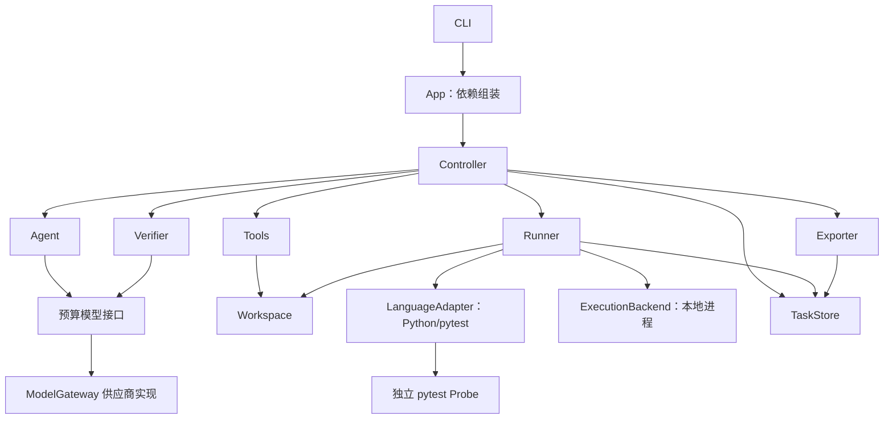

# ReproAgent 项目工程架构

日期：2026-10-05  
状态：基于已讨论方案整理并完成文档自审，用户已授权据此编写[实施计划](../plans/2026-10-05-reproagent-mvp.md)。本文规定工程边界和接口，不代表运行实现已经验证。

依据：[项目设计与优化路线](2026-10-05-reproagent-design.md)、[设计审查记录](2026-10-05-reproagent-review.md)，以及后续关于模块化单体、扩展接口和设计难点的讨论。当前工作区只有设计资料，本文中的代码目录和接口均为拟议结构。

## 1. 目标与范围

开发者提供本地 Python 仓库、Bug 描述和已有 pytest 环境。系统读取真实实现与已有测试，构造候选，实际执行，在新工作副本中确认后导出测试、运行说明和证据。

第一版采用 Python CLI、单个探索 Agent、确定性 Controller、本地子进程。用户原仓库不作为 Agent 写入目标；模型不能修改业务代码、已有测试或配置，也不能自行宣布任务成功。

成功交付的测试断言有来源的正确行为：问题版本因目标缺陷失败；有兼容修复版本时，同一测试应通过。没有修复版本时报告两次一致观察及限制，不能宣称已完成差异验证或根因证明。

延续原设计的范围：

- 用户提供能够运行目标测试的环境，不要求整个应用或所有测试都能运行。
- 真正的依赖或资源阻塞交付诊断和未验证候选。
- 不自动安装依赖、修复代码、准备外部服务、切换项目版本或发布结果。
- 运行受阻后自动选择更小范围、Docker、JS/TS、多候选策略、恢复和 IDE 接入均为后续能力。
- 本地文件副本不构成进程沙箱；第一版面向用户信任的项目和测试资源。

本文细化原设计的实现边界；产品范围和验收要求仍以原设计为准。发生冲突时先修订规格，不通过实现扩大范围。

## 2. 架构选择

| 方案 | 判断 |
| --- | --- |
| 模块化单体 | 采用。一个主进程组织任务，各模块通过数据对象和接口协作，测试在子进程运行，适合个人开发和逐步验证 |
| 图编排框架 | 暂不采用。当前状态转换和单 Agent 工具闭环可以直接表达，尚无需要框架解决的并行编排问题 |
| 服务与执行 Worker | 后续按并发和远程运行需求引入，目前会增加部署、队列和状态一致性的成本 |

保持四个变化边界：模型供应商、语言/测试框架、执行环境、探索策略。前三个定义小接口；探索策略通过 `next_action` 边界组织，第一版只有一个实现，不建设动态插件系统。

通用核心保存任务、契约、候选和证据关系。语言适配器负责测试命令和框架信息，执行后端负责进程与资源。验证器执行不可绕过的通用规则，并使用语言适配器提供的框架事实。

## 3. 拟议项目目录

```text
reproagent/
├── pyproject.toml
├── README.md
├── src/reproagent/
│   ├── __init__.py
│   ├── __main__.py
│   ├── cli.py
│   ├── app.py
│   ├── core/
│   │   ├── models.py
│   │   ├── ports.py
│   │   ├── controller.py
│   │   ├── budget.py
│   │   ├── agent.py
│   │   ├── tools.py
│   │   └── verifier.py
│   ├── adapters/
│   │   ├── models/
│   │   │   └── provider.py
│   │   ├── languages/
│   │   │   └── python_pytest/
│   │   │       ├── adapter.py
│   │   │       ├── collector.py
│   │   │       └── probe/reproagent_pytest_probe.py
│   │   └── runtimes/
│   │       ├── local.py
│   │       └── process_tree.py
│   ├── workspace.py
│   ├── runner.py
│   ├── store.py
│   ├── exporter.py
│   └── prompts/
│       ├── analyze_issue.md
│       ├── explore.md
│       └── review_evidence.md
├── tests/
│   ├── unit/
│   ├── integration/
│   └── fixtures/projects/
├── evals/
│   ├── README.md
│   └── cases/
└── docs/superpowers/specs/
```

这是职责地图，实施时允许合并短小且紧密关联的文件。不得为了与目录一一对应而增加独立服务、管理器或抽象基类。`provider.py` 表示首个供应商适配文件；核心不依赖供应商 SDK。目录中不提前创建 Docker、JS/TS 等空实现。

`probe` 是随工具分发的独立执行辅助模块，不导入 ReproAgent 主包、模型 SDK或存储模块。它仅使用目标环境已有的 pytest 和兼容的标准库；控制器与目标项目解释器不必相同。发布支持范围以集成测试覆盖的解释器/pytest 组合为准，遇到不兼容时报告明确限制，不升级用户环境。

## 4. 模块职责与依赖

| 模块 | 对外职责 | 依赖与限制 |
| --- | --- | --- |
| CLI | 参数与配置读取、进度显示、取消请求、退出码 | 调用应用入口，不写入任务状态 |
| App | 校验配置并组装模块 | 唯一选择具体适配器的位置，不承载复现逻辑 |
| Controller | 状态转换、动作分发、预算、重放和终止 | 调用其他模块；独占任务状态写入权限 |
| Agent | 整理 Issue 契约、提出探索动作和候选假设 | 通过受预算控制的模型接口调用；无直接子进程和文件写入权限 |
| Tools | 搜索、读取、候选写入与动作参数校验 | 访问工作空间和候选仓库；不能调用 Controller |
| Workspace | 冻结代码、文件清单、候选落位、干净运行副本 | 文件操作；不判断是否复现 |
| Runner | 组织一次执行、采集并归一化结果 | 协调 Workspace、LanguageAdapter 和 ExecutionBackend；不作语义判定 |
| Verifier | 硬性规则检查与目标问题语义核对 | 读取契约/候选/证据；可调用预算模型接口；不执行测试 |
| Store | 原子保存对象、追加事件、读取记录 | 第一版为本地文件，单任务单写者；不调度或自动恢复 |
| Exporter | 输出清单、报告、候选和运行说明 | 只使用已保存的结构化记录，不额外调用模型 |



图中是调用与依赖关系，Probe 实际运行在测试子进程中。通用数据和接口位于依赖底层，不导入控制器或基础设施；core 不导入适配器目录。Controller 使用 App 注入的模块，Workspace、Store、Exporter 第一版直接使用具体模块，暂不为假设中的远程存储增加接口层。基础设施可以引用通用数据类型，不能回调 Controller。

原设计中 `Tools.invoke(run_candidate)` 的逻辑在工程实现中细化为：Controller 识别执行动作并调用 Runner；Tools 不持有 Controller 回调。这样避免 Tools → Runner → Controller 的循环依赖。Agent 的 `submit_candidate` 也仅是验收申请，Controller 决定是否进入重放。

## 5. 扩展接口

以下是接口契约的伪签名，不是可运行实现。类型定义集中在 `core/models.py`，接口集中在 `core/ports.py`，外部响应在适配器内转换。

```text
ModelGateway.complete(ModelRequest, CallContext) -> ModelResponse

LanguageAdapter.inspect(ProjectView, LanguageConfig)
    -> LanguageInspection
LanguageAdapter.describe_environment(LanguageInspection, ProbeResults)
    -> EnvironmentSnapshot
LanguageAdapter.build_execution(Candidate, RunWorkspace, EnvironmentSnapshot)
    -> ExecutionSpec
LanguageAdapter.normalize(RawExecution, ProbeArtifacts) -> TestObservation
LanguageAdapter.check_framework(Candidate, TestObservation) -> FrameworkChecks

ExecutionBackend.execute(ExecutionSpec, RunContext) -> RawExecution

Explorer.analyze(IssueDescription, EvidenceContext) -> IssueContract
Explorer.next_action(AgentContext) -> AgentAction
```

### 5.1 ModelGateway

统一文本、结构化动作、调用 ID、token 用量、耗时、计费来源和错误类别。供应商特有字段保存在适配器元数据里，不进入 Controller 的判断分支。

所有调用先经过同一个预算包装器，Issue 分析、探索、语义验证与重试均包含在内。调用方不能拿到绕过预算的原始 SDK 客户端。费用记录区分供应商报告、估算和未知；估算不能显示为精确账单。用户配置费用限制时，适配器必须支持调用前保守预留和调用后结算，否则报告不支持该限制，不静默忽略。时间与步数限制始终执行。

每次调用都有超时和输出上限；取消后不发新请求。临时错误最多额外重试两次，消耗原预算；格式错误反馈给 Agent，计入探索步数。未知动作或无效参数不能获得文件/执行权限。

### 5.2 LanguageAdapter

Python/pytest 实现负责识别配置和测试作用域、形成解释器与参数数组、提供 Probe、处理 pytest 节点及阶段信息，并提出框架相关的检查结果。

语言适配器不创建操作系统进程、不自行安装依赖、不直接宣告复现。`inspect` 返回静态检查事实和受限探测规格，由 Runner 执行；`describe_environment` 归纳探测结果形成环境记录。不能在接口内部藏一个不受预算限制的 shell 调用。

未来 Vitest 适配器增加自己的命令、收集器和断言检查。通用流程仍使用 `TestObservation`，框架特有事实保存在带适配器标识和格式版本的 `framework_details` 中。

### 5.3 ExecutionBackend

输入为 Controller 授权的执行规格：参数数组、工作目录、运行资源映射、子进程环境和超时；输出为进程结果、原始日志引用、退出信息和清理状态。

本地实现负责进程树和日志流；未来容器实现负责挂载、容器内路径与终止。运行环境私有值不写入公开的执行规格或清单。后端必须显式声明能力，包括文件副本/容器隔离、资源映射、取消和进程树清理，不能仅换类名就声称具备相同保证。

### 5.4 探索策略

`analyze` 在分析阶段整理契约，必要时根据新来源返回新契约版本；`next_action` 接收契约、只读历史和本轮反馈，返回一个有类型的动作。契约更新由 Controller 校验来源并发布，不能由 Agent 覆盖文件。第一版使用单个模型探索策略；后续多候选、检索增强和执行范围选择仍通过这一边界与 Controller 协作。

策略不能访问用户原仓库进行编辑，不能启动任意命令，也不能修改硬性验收规则。预算与候选历史来自任务上下文，不由每个策略另建一份。

## 6. 数据契约与版本

所有持久化对象包含 `schema_version`。任务、契约、快照、候选和执行使用不同 ID；内容清单采用稳定规范化序列化并计算 SHA-256。文件哈希按原始字节计算，不能在哈希后转换换行或编码。

| 对象 | 必要内容与约束 |
| --- | --- |
| TaskRequest | 仓库、原始 Issue、语言标识、运行配置、输出目录、预算；原请求保存，适配器配置单独归一化 |
| IssueContract | 触发、预期、报告现象、可观察条件、来源、假设、缺口、版本和修订理由；既有版本不覆盖 |
| CodeSnapshot | 当前本地代码清单、内容哈希、排除项、Git 状态（若有）；包含必要未提交内容 |
| EnvironmentSnapshot | 解释器/工具版本、代码来源、导入配置、资源前提及能力；是观察记录，不是可重建环境承诺 |
| Candidate | 文件清单与安装相对路径、契约版本、假设、预期来源、测试选择器、fixture 和前置条件；发布后不可变 |
| ExecutionSpec | 语言适配器产生的 argv、cwd、选择器、Probe 和资源映射；绑定快照/候选哈希，不保存密钥值 |
| ExecutionResult | 运行 ID、快照/环境/候选/契约绑定、进程结果、TestObservation、日志引用、文件检查和清理结果 |
| Verdict | 候选分类、证据引用、未满足项、不确定项和建议；不得只保存布尔值或模型置信度 |
| TaskResult | 终止状态、原始停止原因、最后有效候选、证据级别和导出状态；与单次候选分类分开 |
| TaskEvent | 序号、时间、事件类型、关联 ID、载荷和格式版本；事件不能覆盖原始证据 |

通用测试选择器包含适配器标识及字符串标识；pytest node ID 是 pytest 适配器对该字段的解释。通用观察记录收集与执行是否发生、测试状态、阶段角色和证据引用；pytest 的 xfail、fixture、原始节点信息保留在框架详情中。无法映射的框架状态保存原值，不能强制视作通过或目标失败。

原设计的 `python`、`pytest_args`、`baseline_tests`、`target_modules`、`source_roots`、`candidate_parent` 继续作为第一版输入。App 将其转换成 Python/pytest 配置，Controller 不逐一解释这些字段。未来新增语言使用对应配置类型，不沿用名字为 `pytest_args` 的通用字段。

敏感配置从调用进程或用户明确配置读取，公开记录仅保存必要变量名称与提供方式。原始测试日志也可能包含敏感内容：任务目录保留本地原始证据，给模型的片段和导出副本进行已知值脱敏；不能承诺自动识别所有秘密，发布前由用户检查。不向模型或导出包提供凭据配置原文。

## 7. 工具与动作权限

| 动作 | Controller 的处理 |
| --- | --- |
| search_code | Tools 在冻结代码和已登记候选中检索，返回带位置的有限结果 |
| read_file | Tools 检查路径和范围，分段读取；不读取凭据和排除文件 |
| write_candidate | 校验新增文件、位置、支持数据和假设，原子发布新候选；修改产生新 ID |
| run_candidate | 检查预算和候选存在性，交给 Runner，保存结果并运行 Verifier |
| submit_candidate | 核对证据与当前契约/候选，再申请确认重放；模型自报成功无效 |

动作入口不接受任意 shell 字符串、任意业务文件路径或无限输出。用户预先配置的 pytest 参数和项目插件属于可信项目配置，仍记录最终生效命令；Agent 不能用动作覆盖 Probe、扩大测试选择范围或关闭验证。参数冲突在执行前报告。

Issue、仓库文本和测试输出作为待分析数据进入模型上下文；其中要求绕过工具权限或修改验证标准的文字不产生系统权限。授权始终由 Controller 和工具参数校验决定。

## 8. 一次任务的完整流程

1. App 校验请求、解释器路径、输出位置和适配器能力，创建任务目录。不能把任务目录递归复制进自身快照。
2. Controller 创建统一 Budget 和取消上下文，保存原始请求与 Issue。
3. Workspace 冻结当前代码状态，生成清单；后续运行只从这个快照创建副本。
4. 语言适配器提出基础检查，由 Runner 在临时副本执行，保存环境事实。已有测试断言失败不直接等于环境不可用。
5. Agent 整理 IssueContract；预期或关键触发条件无法确定时保存问题并以 NEEDS_INFORMATION 结束。
6. Agent 提出搜索/读取动作，Controller 通过 Tools 执行并反馈带来源的位置。
7. Agent 提出候选，Workspace/Store 冻结文件、参数和安装位置，分配新 ID。
8. Controller 接收 run_candidate，Runner 新建运行副本，核对保护文件与候选哈希。
9. LanguageAdapter 形成 ExecutionSpec；ExecutionBackend 启动测试、采集日志并完成受控清理。
10. Runner 保存原始结果、Probe 产物、实际导入路径、文件变化检查与归一化观察。
11. Verifier 先检查硬性规则，再进行带证据引用的语义核对，反馈具体失败原因。
12. 无效候选或未复现返回探索；确定的环境阻塞终止。没有足够信息作分类时保留不确定项，不强行判断成功。
13. 候选得到初次支持并提交后，Controller 在相同冻结快照的新副本中执行同一候选，再次验证。
14. 两次目标观察一致且满足全部条件后进入导出。可选修复版本验证在独立上下文执行，生成阶段不可读取修复材料。
15. Exporter 原子发布清单和报告。只有成功包完整、必需证据齐备且执行清理确认后，Controller 才标记 DONE。

状态沿用原设计：PREPARING → ANALYZING → GENERATING → EXECUTING → VERIFYING → REPLAYING → EXPORTING。探索反馈回到 ANALYZING/GENERATING；终止为 DONE、BLOCKED、NEEDS_INFORMATION、EXHAUSTED、FAILED 或 CANCELLED。

REPRODUCED 是候选受到当前证据支持的判定，不等于任务 DONE。重放未完成、导出失败或清理失败时，保留已有观察并报告实际终止状态。结束状态、证据级别和导出状态为三个独立字段。

## 9. 工作副本与候选冻结

冻结快照保留项目所需源码、已有测试、配置和必要数据。默认排除 Git 内部对象、任务输出目录和明确的缓存/虚拟环境目录；排除项可审查，不能泛化删除所有构建产物，因为编译或生成文件可能是目标运行条件。

Agent 读取冻结快照与已登记候选，不读取已经被测试污染的运行目录作为源码事实。每次运行创建新目录、新临时输出目录和新进程，再按清单安装候选。测试应放在目标测试目录或其子目录以继承适当 fixture；不能覆盖原有文件。

所有路径按仓库相对位置记录，解析真实路径后检查归属。默认拒绝越界符号链接或目录联接；确需外部资源时作为环境前提处理。候选文件路径、支持文件、源码根目录和缓存例外均进行检查，不能使用一个宽泛的“允许 tests 变化”规则。

保护源码、已有测试、conftest、项目配置、依赖声明。运行前后核对受保护清单；候选文件也核对哈希。允许变化的输出位置与原始保护文件冲突时拒绝配置。原工作目录外的副作用和数据库状态无法由哈希保证，仍需用户提供独立测试资源和已明确的重置条件。

共享资源不能恢复前置状态时，保留一次观察，结束为 BLOCKED 并解释不能确认的原因；不得把再次运行同一受污染状态当作第二次独立观察。

## 10. pytest 执行与证据采集

### 10.1 解释器与 Probe 加载

使用用户指定解释器的绝对路径，以 argv 调用 `python -m pytest`。通过单次子进程的模块搜索路径提供独立 Probe，并使用明确插件名加载；不安装 ReproAgent 到用户虚拟环境，不写入项目 conftest。pytest 提供 `-p` 显式加载插件的机制。[官方插件加载说明](https://docs.pytest.org/en/stable/how-to/writing_plugins.html#plugin-discovery-order-at-tool-startup)

Probe 所在目录与源码根目录分别记录，构造子进程环境时避免隐式引入原仓库路径。保留项目插件和导入模式，记录最终生效配置；发现 Probe 名称冲突或配置关闭 Probe 时停止接受结果，不静默继续。

### 10.2 结构化观察

Probe 使用公开 hook 记录会话、收集结果、测试阶段和结束标记；`pytest_runtest_logreport` 提供 setup/call/teardown 阶段报告，`pytest_sessionfinish` 提供会话结束入口。[官方 hook 参考](https://docs.pytest.org/en/stable/reference/reference.html#pytest.hookspec.pytest_runtest_logreport)

输出独立 JSONL 文件，事件包含 probe 格式版本、run ID、序号和节点。执行配置 ID、候选哈希和契约绑定由 Runner 从执行前清单附加；不信任候选代码自行打印的标识。逐条刷新记录，强制终止后仍可保存部分事件；没有结束标记时标注采集不完整，不能当作成功完成。

stdout/stderr 同时保留文件，不以日志中的“reproduced”字符串作为判定。记录失败阶段、异常/断言位置、跳过和 xfail 信息；只把明确对应目标路径的失败交给语义验收。第一版按串行 pytest 采集设计，xdist 等多进程插件不默认承诺支持；无法完整观察时报告覆盖限制。

### 10.3 真实源码绑定

在实际测试进程检查目标模块的 `__file__` 或 `__spec__.origin`，按明确源码根目录核对工作副本来源。记录目标代码调用位置；只观察到模块加载不能证明触发路径已经执行，还需核对测试和失败证据。

只观察已加载模块，不为了采集而额外导入目标包，避免改变触发时机。目标导入本身是 Bug 时，允许在测试函数内触发并使用异常栈及可用的模块来源作为证据；不能把所有导入失败自动排除为环境坏掉。没有足够路径证据或来源仍为旧安装包时不接受。

pytest 的导入方式会影响路径选择，实际来源检查不能由一次独立预检查替代。[官方导入机制说明](https://docs.pytest.org/en/stable/explanation/pythonpath.html)

### 10.4 进程与日志资源

Runner 使用最小的剩余任务时间和单次命令时间作为执行上限，持续写日志到文件。初始建议每次执行原始日志总量最多 32 MiB，每个工具响应文本最多 32 KiB；完整证据保存在文件中，按范围取片段给模型。这些上限可配置并写入任务记录。达到日志容量限制时停止本次执行并报告资源限制，不无限读入内存，也不接受被截断的成功结论。

本地后端按平台管理进程树。Windows 采用 Job Object 的进程生命周期边界，类 Unix 采用受控进程组；限制必须在测试开始产生子进程前建立。微软文档说明 Job Object 可关联进程，并在指定关闭行为下终止关联进程。[Job Objects 官方说明](https://learn.microsoft.com/en-us/windows/win32/procthread/job-objects)

这不承诺控制恶意逃逸进程或外部任务。支持能力必须通过“测试派生子进程后取消”的集成用例验证；无法建立要求的进程边界时报告覆盖限制。终止失败时不删除或复用运行目录，以 FAILED 结束并保留最初超时/取消原因。

## 11. 验证规则与判定边界

Verifier 分为规则阶段与语义阶段。规则阶段不通过，模型不能覆盖结果。

程序规则必须核对：候选/契约/运行绑定、Probe 完整性、目标节点实际执行、真实源码来源、保护文件和候选哈希、skip/xfail 状态、明确配置的外部前置条件，以及执行清理状态。静态检查可以指出宽泛捕获、可疑 mock 等结构，但不能宣称已从代码形式证明其语义；是否绕过目标检查仍需结合上下文审查。

框架错误和无关失败优先形成具体反馈：未知 fixture、候选语法错误通常是 INVALID_CANDIDATE；有明确缺依赖/资源证据才是 ENVIRONMENT_BLOCKED；有效执行但不支持目标问题是 NOT_REPRODUCED。分类同时记录归类依据和阶段，不能由 pytest 退出码一项决定。

语义阶段检查触发条件、正确行为来源和目标失败是否一致，审查测试是否 mock 掉实际缺陷或人为制造错误。模型返回证据引用和未满足条件；引用必须能解析到已保存测试/日志/契约位置，缺引用或判断不明确时不接受成功。

语义核对仍可能误判，不能宣称规则组合已证明根因。报告展示实际证据和不确定项，评估集通过人工审查和兼容修复版本校验误报。

两次确认运行使用相同 candidate manifest、contract version、code snapshot 和可重置前置条件。比较目标节点、失败位置及关键现象，允许时间、临时路径等非语义字段不同，不用完整 stdout 字符串相等作为一致性标准。

预期、触发条件或目标异常改变时创建新契约版本，记录新来源；旧候选不能直接继承新契约下的成功。策略可以利用失败证据修正实现方式，不能为了匹配当前结果改写问题定义。

## 12. 预算、错误与结束

预算包括探索步骤、任务时间、单次命令时间、模型用量/费用。默认建议沿用原设计的 20 步、60 秒命令、900 秒任务、10 秒清理；它们是可配置起点，不是性能承诺。每次 Agent 动作计一步，内部模型调用额外计入调用、时间和费用统计。

主任务预算结束后停止新模型调用、搜索和候选执行。进程清理使用独立有限预算，本地记录与诊断输出使用有限收尾预算，两者均计入总耗时且不可用于继续探索。Exporter 无模型调用，不在收尾阶段补造成功证据。

| 情况 | 任务终止或处理 |
| --- | --- |
| 缺少有依据的预期或关键条件 | NEEDS_INFORMATION，保存具体补充问题 |
| 确认目标必需环境/资源缺失，或当前适配器不覆盖 | BLOCKED，保存阻碍与已有候选 |
| 无效候选、无关失败、目标未复现 | 返回探索，保留分类与反馈；耗尽后 EXHAUSTED |
| 已有一次观察但预算不足以确认 | EXHAUSTED，保留一次观察；不能标 DONE |
| 重放结果不一致 | 保存全部观察并继续探索；不升级为两次一致 |
| 用户取消，执行清理成功 | CANCELLED，保存部分记录 |
| 主任务超时，执行清理成功 | EXHAUSTED，保存部分记录 |
| 进程清理、内部持久化或导出失败 | FAILED，保留原始停止原因及可恢复证据 |
| 成功候选确认、证据与成功包齐备 | DONE |

环境阻塞与实现内部错误分开。意外异常由 Controller 捕获，尽力写入诊断；无法写入任务目录时通过 CLI 指出记录不完整，不能声称产物已保存。

## 13. 存储、事件与导出

```text
task-id/
├── request.json
├── issue.md
├── task.json
├── events.jsonl
├── contracts/
├── snapshots/
├── environments/
├── candidates/<candidate-id>/
│   ├── manifest.json
│   └── files/
├── runs/<run-id>/
│   ├── execution.json
│   ├── probe.jsonl
│   ├── stdout.log
│   └── stderr.log
├── verdicts/
└── export/
    ├── manifest.json
    ├── report.md
    ├── issue_contract.json
    ├── repro/
    ├── candidates/
    ├── runs/
    └── events.jsonl
```

内部任务目录包含更多诊断数据，公开复现包仍沿用原设计的布局；未验证任务导出诊断包并明确类型，不能提供成功复现标记。

对象先写临时文件，再原子替换；候选清单发布前校验文件完整性。事件由单写者分配单调序号，保存状态转换、工具调用、候选发布、执行开始/结束、判定、重放和导出。先写实体再追加引用事件；崩溃可能留下未引用实体或不完整末行，读取时标注而不凭事件推断执行成功。

第一版事件用于查看和审计，不实现完整事件溯源，也不把恢复当作已支持功能。未来恢复读取版本化检查点，重新检查快照/环境并重建运行副本，不能复用未完成运行或直接相信旧成功。

Exporter 根据冻结候选清单逐字节复制测试与支持数据，记录包内路径和仓库安装路径、命令、节点、源码根目录、fixture 哈希、环境变量名称、前置条件和证据级别。报告由结构化记录形成，不能由另一次模型润色改变验证结论。

成功包在临时导出目录形成并校验后整体发布。最终任务事件及状态不放入包内相互递归计算哈希；manifest 的文件清单不包含自身哈希。源 task 的 export.completed 事件引用包清单哈希，报告明确其包含的事件截止序号。

内部两次执行均经过同一候选安装清单；产物验收还必须从导出包安装到独立工作副本验证，不能只证明任务内部路径可用。第一版 CLI 提供 run 和 inspect；导出报告给出项目重跑命令，不提前提供 resume 命令或额外服务 API。

## 14. 后续扩展的接入位置

| 能力 | 新增或调整位置 | 仍需单独验证 |
| --- | --- | --- |
| 更换模型 | ModelGateway 实现与 App 配置 | 动作格式、预算、超时、计费与输出限制 |
| Docker | ExecutionBackend 与环境配置 | 挂载、容器内解释器路径、资源重置和退出清理；不能只替换 launch |
| JS/TS | LanguageAdapter、采集辅助模块、提示及框架规则 | fixture/初始化、源码绑定、失败语义和独立评估集 |
| AST 检索 | Tools 中搜索实现与只读索引 | 内容哈希失效、位置准确性与收益 |
| 多候选探索 | Agent 策略与候选调度策略 | 同一总预算、独立运行状态和去重；Controller 验收仍保留 |
| 自动选择执行范围 | 版本化 ExecutionPlan、策略与适配器支持 | 替代入口保留真实触发路径；本轮不实现 |
| 用例最小化 | 接受候选后的限额优化阶段 | 每次变化生成新候选、重新运行；失败回退原有效候选 |
| 恢复与交互补充 | Store 检查点和应用入口 | 环境漂移、旧证据失效、取消遗留状态 |
| 非确定性问题 | 确认策略与新的证据结构 | 次数、种子、并发条件和统计结论；不能沿用两次观察保证 |
| GitHub / IDE | 输入适配或 App 外部入口、事件展示 | 权限、来源记录和取消传播；不绕过核心验证 |
| 服务与并发 Worker | 任务 API、队列、存储所有权和工作空间隔离 | 单任务写者、租约/幂等、共享资源；并非直接换一个 CLI 即完成 |

扩展性目标是尽量复用状态生命周期、预算和证据关联，不是保证增加任意能力都不用修改核心。尤其并发、非确定性和环境恢复可能需要版本化演进数据契约。

## 15. 验证重点与实施依赖

本节规定行为验收，不是带文件修改步骤和执行方法的实施计划。

| 验证层次 | 关键场景 |
| --- | --- |
| 核心边界 | 候选不可变；契约变更后证据失效；旧日志不能支持新候选；规则失败不能被模型覆盖 |
| 适配器集成 | 普通/src 布局、旧安装包误导入、嵌套 conftest、模块 fixture、目标导入异常 |
| 结果分类 | 正常通过、目标断言/异常、无关失败、未知 fixture、缺依赖、skip/xfail、收集失败和 Probe 不完整 |
| 运行管理 | 首次运行生成文件后重放仍干净；超时与取消回收子进程；清理失败不复用目录 |
| 预算闭合 | 分析/探索/验证共享预算；模型重试受限；确认前耗尽保留部分证据；未知计费不冒充准确费用 |
| 存储与导出 | 写入中断、事件末行损坏、导出失败、清单哈希不一致；按导出路径独立重跑 |
| 实际能力 | 约 20 个有已知历史修复的 Bug，生成阶段隐藏修复信息，固定候选后差异验证及人工审查 |

不使用只检查目录存在、类名正确或复刻实现条件的测试证明功能完成。支持操作系统与解释器/pytest 组合逐项记录通过的集成检查，未验证组合不列为已支持。

实施依赖顺序为：数据与事件契约 → 工作空间/候选冻结 → 本地执行与 Probe → 规则验证 → Agent 和模型接入 → 完整重放与导出 → 真实样本评估。优先验证执行与证据链，再增加模型探索，避免先做会写测试但无法可信验收的演示。

## 16. 文档自审与下一步

已核对以下设计一致性：

- 单 Agent 和 Controller 的权限分开，Tools 不回调 Controller。
- pytest 信息位于语言适配层，本地进程管理位于执行后端。
- 所有模型调用共用预算，导出不继续调用模型。
- 不可变候选、契约版本、快照与执行证据形成关联链。
- 目标失败、初次观察、确认成功和最终任务状态不会混为一个布尔值。
- 干净副本是文件隔离，真实外部状态和进程能力另行说明。
- 运行受阻自动换入口、恢复、多语言、容器和服务化未进入第一版验收。
- 包清单与最终事件不存在相互包含的哈希循环。

以上是文档自审，尚未运行产品实现或评估复现率。用户评审本稿后，再依据本稿与原产品设计编写实施计划；执行产品代码前还需评审计划并选择执行方式。
