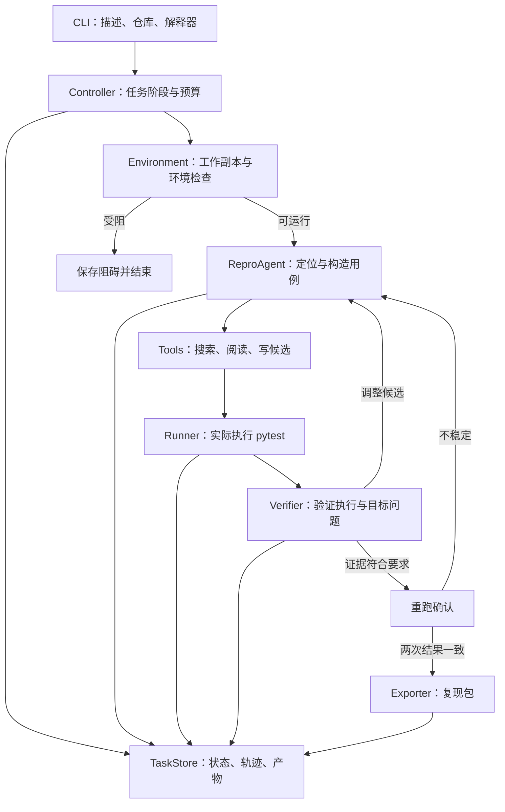

# ReproAgent：Bug 复现 Agent 架构与优化路线

日期：2026-10-05  
状态：已完成主智能体与一个子智能体的设计审查及修订，待用户评审；包含后续优化方向，不包含产品实现代码。审查记录见同目录 `2026-10-05-reproagent-review.md`。工程目录、扩展接口和执行契约进一步细化于[项目工程架构](2026-10-05-reproagent-architecture-design.md)。

## 1. 项目目标

开发者提供 Bug 描述、本地 Python 仓库和可运行的 pytest 环境。ReproAgent 阅读代码与已有测试，构造用例，实际执行，并交付能够重跑的复现包。

典型输入：

> 某个解析函数收到空列表时抛出 IndexError，预期应返回空结果。请在这个仓库中复现。

交付结果包含复现测试、必要输入数据、运行命令、代码与环境信息、执行日志，以及说明问题如何被触发的报告。

产品的核心价值是减少开发者从问题描述到有效复现之间的探索工作。衡量价值依靠实际复现率、重跑成功率、人工介入次数和任务成本；GitHub Star 不作为技术验收指标，也不能据此承诺传播效果。

## 2. 已确认范围与设计假设

### 2.1 已确认的第一版范围

- 支持 Python + pytest。
- 用户提供能够运行测试的环境和解释器。
- 输入为本地仓库与 Bug 描述。
- 输出为可执行复现测试与证据包。
- 采用固定任务流程，内部使用单个 Agent 反复尝试复现。

### 2.2 本稿采用的设计选择

- 第一版提供 CLI，通过本地目录保存任务与产物。
- 用户可以额外提供相关测试入口、环境变量名称、初始化说明和输入数据。
- 工具编辑发生在独立的代码副本，不能改写用户原目录。第一版以用户信任的项目和测试环境为运行前提；文件副本不能强制阻止测试代码访问其他路径。目标代码、已有测试和配置的完整性按第 7 节检查，完整进程隔离放在后续容器阶段。
- 模型供应商通过适配接口接入，核心流程不绑定某一家模型。
- 支持失败、阻碍和预算耗尽的明确报告，不保证每个 Bug 都能复现。

### 2.3 第一版暂不覆盖

- 自动安装任意仓库的完整运行环境。
- 自动修复业务代码或提交修复 PR。
- 浏览器操作与网站验收。
- 多语言、多 Agent 调度和托管服务。
- 自动创建缺失的数据库、云服务、账号或外部资源。
- 将涉及随机性、并发竞争或真实外部服务的复杂问题作为首批主要验收样本。
- 在运行受阻后自动分析必要依赖、切换执行入口和缩小运行范围；这项能力作为后续优化，见第 12 节。

用户已有上述资源时，可以通过明确配置接入；资源缺失时返回具体阻碍。

MVP 围绕用户提供的可运行目标测试环境生成和验证用例，不要求完整服务或全部测试都能运行。当前目标运行受阻时，按既有分类交付诊断与已保存候选；不会自动尝试一系列替代入口。运行受阻后的自适应执行规划不纳入第一版验收。

## 3. 架构方案与参考来源

| 方案 | 工作方式 | 取舍 |
| --- | --- | --- |
| 固定流程 + 单 Agent，采用 | 程序管理阶段、验证和预算，模型负责探索与生成 | 流程可审计，便于评估和定位失败原因 |
| 完全自主 Agent | 模型自行决定环境处理、探索和结束 | 灵活，但结束条件与成本控制更困难 |
| 多 Agent 分工 | 定位、生成、审查分别使用 Agent | 增加调用成本和协调复杂度，第一版先不引入 |

参考项目及借鉴边界：

- [mini-swe-agent](https://github.com/SWE-agent/mini-swe-agent)：借鉴模型、Agent、环境的分离，以及查询模型、执行动作、反馈结果的循环。
- [Agentless](https://github.com/OpenAutoCoder/Agentless)：借鉴定位与测试验证的拆分。其 [测试目录](https://github.com/OpenAutoCoder/Agentless/tree/main/agentless/test) 包含复现测试生成和执行模块，但其 SWE-bench 环境假设需要重新适配普通本地项目。
- [AutoCodeRover](https://github.com/AutoCodeRoverSG/auto-code-rover)：借鉴按程序结构检索相关类、函数的思路，作为后续定位优化。
- [SWE-agent 架构](https://swe-agent.com/latest/background/architecture/)：参考执行环境、工具接口与历史处理的分离。
- [OpenHands SDK](https://github.com/OpenHands/software-agent-sdk)：参考会话、工具和工作空间的模块边界，作为后续服务化设计参考。

以上是架构参考。下文的状态、数据结构和验证规则是本项目的设计建议，不代表这些项目已经采用相同机制。

## 4. 总体结构



依赖方向：Controller 调用各模块；Agent 通过 Tools 探索和提交候选；Runner 只负责执行与记录；Verifier 读取问题契约和运行证据。模块不得通过读取模型对话中的一句“成功了”来绕过验证流程。

第一版在一个 Python 进程内组织这些组件，无需引入分布式队列或独立微服务。

## 5. 模块职责与接口

以下为接口约定，具体类型实现留给后续实施计划。

| 模块 | 输入 | 输出 | 职责与边界 |
| --- | --- | --- | --- |
| Controller | TaskRequest | TaskResult | 驱动状态机，管理预算、取消、重试和最终结果 |
| Environment | 仓库、解释器、初始化配置 | EnvironmentSnapshot | 创建工作副本，检查环境、导入路径与代码来源 |
| IssueAnalyzer | 描述、补充信息、已读取证据 | IssueContract | 整理触发条件、预期行为、实际行为和信息缺口 |
| ReproAgent | 问题契约、历史、工具结果 | 下一步工具动作或候选提交 | 查找代码、构造测试、根据反馈调整 |
| Tools | 结构化工具参数 | ToolResult | 提供搜索、读取、写候选与请求执行能力 |
| Runner | Candidate、执行配置 | ExecutionResult | 执行测试，记录收集结果、日志、异常、时间与退出码 |
| Verifier | IssueContract、Candidate、ExecutionResult | Verdict | 区分环境问题、无效用例、未复现与目标复现 |
| TaskStore | 状态、事件、产物 | 可读取的任务记录 | 保存恢复与审计所需数据 |
| Exporter | 最终候选、运行证据、环境快照 | 复现包路径 | 导出测试、数据、命令、报告和清单 |

主要接口：

```text
Controller.run(request) -> TaskResult
Environment.prepare(request) -> EnvironmentSnapshot
IssueAnalyzer.extract(description, evidence) -> IssueContract
ReproAgent.step(context) -> AgentAction
Tools.invoke(action) -> ToolResult
Runner.execute(candidate, environment) -> ExecutionResult
Verifier.evaluate(contract, candidate, executions) -> Verdict
TaskStore.append(event)
Exporter.export(result) -> ArtifactManifest
```

IssueAnalyzer 可以复用同一模型适配器，在分析阶段调用，并随着有来源的新证据修订问题契约；不需要作为独立自主 Agent 运行。所有模型调用，包括分析和语义验证，都计入同一任务的时间与费用预算。

## 6. 输入与核心数据结构

### 6.1 TaskRequest

```yaml
repo: /path/to/project
issue_file: /path/to/issue.md
python: /path/to/venv/bin/python
pytest_args: ["-q"]
baseline_tests: ["tests/test_parser.py"]
target_modules: ["example.parser"]
source_roots: ["src"]
candidate_parent: tests/parser
output_dir: /path/to/repro-results
limits:
  agent_steps: 20
  command_timeout_seconds: 60
  task_timeout_seconds: 900
  cleanup_timeout_seconds: 10
  model_cost_limit: null
```

这些预算数值是初始配置建议，不是性能承诺。模型费用上限按用户配置启用；无法准确计费的适配器必须明确标注估算或未知，仍执行步数与时间限制。

命令使用用户指定解释器，通过参数数组调用 `python -m pytest`。不依赖当前 PATH 中的 `python`，路径和参数分别传入，以适配 Windows 和类 Unix 环境。

`baseline_tests` 可选：用户没有提供时执行解释器、pytest、目标包导入等基础检查。基础检查通过不代表整个测试套件通过，也不代表项目所有依赖都完整。

`target_modules`、`source_roots` 和 `candidate_parent` 可选，可从相关测试及项目配置推导；无法确定代码来源或 fixture 作用域时输出具体信息缺口。源码根目录和测试位置按仓库相对路径记录，并检查解析后的路径位于工作副本内。导入调整仅作用于当前子进程，不重装或修改用户虚拟环境。

已有基线测试的断言失败不自动判定环境不可用：它可能就是项目原本存在的问题。保留基线失败，检查其是否与本次目标相关。基础环境故障需要明确的依赖或工具证据，不能仅凭退出码归类。目标包导入异常或测试收集异常如果可能就是 Issue 描述的现象，应进入分析；优先把目标导入放进可执行测试函数内观察。无法构造第一版支持的测试形式时报告覆盖限制，不伪装成缺依赖。

### 6.2 IssueContract

- `trigger`：触发条件与必要前置状态。
- `expected`：预期行为。
- `reported_actual`：用户报告的实际行为。
- `observable_checks`：候选用例需要记录的可观察条件。
- `sources`：每项判断依据来自 Issue、用户补充信息、项目测试或文档的位置。
- `assumptions`：推断内容及其不确定性。
- `missing_information`：阻止继续构造有效用例的信息缺口。
- `contract_id`、`version`、`description_hash`：标识问题契约及原始描述。
- `revision_reason`：新证据、变化字段与修订原因。

例如“空输入应返回空列表”，必须有来源。当前实现返回某个值本身不能证明那个值就是正确规范。预期行为缺失时，先记录异常现象或给出待确认结论，不把模型编造的断言当作规范。

原始描述和已有契约版本不可覆盖。改变触发条件、预期或目标异常时，必须附上新的用户信息或项目证据；不能因为候选没有复现，就把预期改成候选实际得到的结果。候选与判定绑定具体契约版本，契约实质变更后需要重新验证。

### 6.3 Candidate

- 候选 ID、父候选 ID。
- 测试文件、辅助数据及内容哈希。
- 复现假设、触发输入和对应问题契约。
- 使用的问题契约版本与目标断言来源。
- 运行节点 ID 与必要 pytest 参数。
- 对已有 fixture 和初始化步骤的依赖。
- 相对安装位置、支持文件清单及需要控制的测试前置状态。

候选发布后不可变。修改测试、辅助文件、安装位置或运行参数时创建新的候选 ID，旧版本及其执行证据保留。提交、重跑和导出均核对候选清单哈希，不能以旧版本日志证明新版本有效。

### 6.4 ExecutionResult

- 实际解释器、命令参数、工作目录、环境快照 ID、代码快照 ID、候选 ID 与内容哈希。
- 测试收集状态、被执行的测试节点、通过/失败/跳过结果。
- 标准输出、标准错误、异常类型、失败断言与 traceback。
- 时间、退出码、超时标记。
- 目标模块实际加载路径、受保护文件修改检查结果。
- 测试的 setup/call/teardown 阶段结果，以及 xfail、xpass 等有效执行信息。

结构化结果通过固定的 pytest 集成收集，原始日志同时保留。第一版对 subprocess 内部细节、复杂分布式调用等无法观测的情况，在报告中明确说明。

### 6.5 Verdict 与 TaskResult

Verdict 保存分类、问题契约版本、对应候选及执行 ID、理由、证据位置、未满足条件和建议下一步。TaskResult 保存任务结束原因、最后有效候选、证据级别和导出状态，避免混淆“某个候选未复现”与“整个任务已耗尽预算”。证据级别区分一次目标观察、两次一致观察、修复版本差异验证；没有修复版本时不能显示为差异验证已通过。

## 7. 环境与工作空间

1. 将用户提供的代码状态复制到独立工作目录，记录 Git commit（如存在）、未提交修改和必要文件哈希。第一版以当前本地代码状态为准，不自动切换版本。
2. 保留项目测试目录结构、pytest 配置和必要的 `conftest.py`。候选使用唯一文件名，放在目标测试所在目录或其子目录，以继承对应的目录 fixture；不能假定仓库根目录下的统一临时目录能访问任意测试 fixture。模块或类内的 fixture 需明确复用方式，无法复用时可在新候选内重建有来源的初始化步骤，不覆盖已有文件。[pytest fixture 作用域说明](https://docs.pytest.org/en/stable/reference/fixtures.html#fixture-availability)
3. 使用用户指定解释器执行；工作副本与原项目共享依赖环境，因此第一版的工作副本是文件隔离，不是完整进程沙箱。
4. 在实际测试子进程检查目标模块加载路径，不能只在单独的预检查进程验证。对于普通布局和 `src` 布局，通过工作目录及显式源码根路径绑定工作副本，并保留项目使用的 pytest 导入模式。若运行中导入仍指向原目录或已安装的另一份代码，候选证据不被接受；需用户提供适配说明。无法绑定工作副本的编译扩展和特殊导入机制报告覆盖限制，不修改用户安装。[pytest 导入机制说明](https://docs.pytest.org/en/stable/explanation/pythonpath.html)
5. 环境变量由用户显式配置。记录复现需要的变量名称和使用方式，导出包不包含密钥值。
6. 每次执行前后检查受保护文件：业务源码、已有测试、已有 `conftest.py`、项目配置和依赖声明。检测到这些文件被改动的候选无效，重建工作副本后再继续。缓存、测试输出等允许变化的位置由配置明确列出，不能将整个测试目录排除在检查之外。运行时 monkeypatch/mock 必须是有来源的必要测试前置步骤，不能替换目标逻辑、人为抛出目标异常或伪造返回值来制造复现。
7. 文件哈希不能消除数据库、外部服务等副作用。此类任务需要用户提供独立测试资源和初始化/清理步骤；第一版不自动在共享资源上试验。

用例需要运行时配置或生成辅助数据时，通过已记录的参数、环境变量或新的测试数据文件表达，不覆盖已有受保护配置。执行目录在用户配置范围内，Agent 的写文件接口仅接受候选测试与产物位置。

每次候选执行和确认重跑都从同一个冻结代码快照创建新的工作副本，使用新的 pytest 子进程及临时输出目录。候选必须声明生成文件和状态清理需求；不能通过第一次运行留下的数据让第二次“复现”。共享外部资源无法恢复前置状态时，不输出两次一致观察的结论。

## 8. 执行流程与状态机

### 8.1 正常流程

```text
PREPARING
  → ANALYZING
  → GENERATING
  → EXECUTING
  → VERIFYING
  → REPLAYING
  → EXPORTING
  → DONE
```

未复现或候选无效时，从 VERIFYING 返回 ANALYZING 或 GENERATING。重跑不稳定时返回探索流程，保留此前观察结果。Controller 在各阶段入口和外部调用前检查预算与取消标记。

模型服务的临时连接错误和限流可重试，每次调用最多额外重试两次；重试仍计入总时间和实际费用。格式错误反馈给 Agent 并计入步数。达到限制或出现不可恢复错误时结束任务，不能无限重试。外部调用须设置超时。

Runner 为每次测试建立可管理的进程树边界（按平台使用进程组或 Windows 作业对象等机制），超时或取消时终止 pytest 及其 worker/子进程，等待退出后再清理。清理使用独立的有限预算，示例为最多 10 秒，计入最终报告的总耗时；主任务预算结束后不得继续模型调用或候选探索。进程退出或状态清理无法确认时以 FAILED 结束并记录原始超时/取消原因，不能重用污染工作目录继续执行。

### 8.2 任务结束状态

| 状态 | 含义 |
| --- | --- |
| DONE | 已导出复现结果和重跑证据 |
| BLOCKED | 环境、外部资源或第一版覆盖限制阻碍继续执行 |
| NEEDS_INFORMATION | 关键描述存在歧义，现有证据不足以确定目标行为 |
| EXHAUSTED | 达到步数、时间或费用限制，任务尚未完成；可能保留部分有效观察 |
| FAILED | ReproAgent 自身或模型服务发生无法恢复的错误 |
| CANCELLED | 用户终止任务 |

所有结束状态都保存任务记录。失败和阻碍报告包含已尝试的候选、最后执行结果、具体缺失信息和可采取的下一步。

如果已经观察到目标问题，但确认重跑、导出或清理尚未完成就耗尽预算，保留已有证据并标注不完整，以 EXHAUSTED 或 FAILED 结束，不改写为“完全没有观察到问题”，也不标记 DONE。预留有限的本地收尾时间用于保存记录，收尾阶段不再调用模型或继续探索。

### 8.3 Agent 工具

- `search_code(query, scope)`：搜索符号、错误文本和相关测试。
- `read_file(path, range)`：分段读取实现、fixture 和配置。
- `write_candidate(files, hypothesis)`：写入候选与必要输入数据。
- `run_candidate(candidate_id)`：请求 Runner 执行已保存候选。
- `submit_candidate(candidate_id, evidence_refs)`：提交证据供 Verifier 检查。

第一版不提供任意业务文件编辑工具。候选运行只能执行配置好的 pytest 入口和已登记测试。这个限制有助于保持行为可追踪，但并不能替代后续真正的进程隔离。

## 9. 复现验证规则

### 9.1 候选分类

| 分类 | 判断依据 | 下一步 |
| --- | --- | --- |
| ENVIRONMENT_BLOCKED | 基础检查失败，或必要依赖、资源不可用 | 返回阻碍；可根据明确配置重新检查 |
| INVALID_CANDIDATE | 语法错误、未知 fixture、错误调用方式、修改受保护文件或伪造目标行为 | 返回具体错误，让 Agent 调整 |
| NOT_REPRODUCED | 用例有效执行，但结果未支持目标问题 | 调整输入、假设或相关代码范围 |
| REPRODUCED | 触发条件与结果符合目标问题，且有可审查执行证据 | 重跑确认后导出 |

无法确定是环境问题还是错误调用时，不强行归类成功；保存不确定原因，继续探索或以 NEEDS_INFORMATION 结束。

### 9.2 成功条件

- 目标测试被收集并实际执行，不能全部跳过。
- 最终交付测试断言有来源的预期正确行为：问题版本因目标异常或目标断言失败，修复版本（若提供）应通过同一测试。探索阶段可以捕获异常观察，但不能把“期待错误行为发生”的探针直接作为最终测试。
- 触发条件与 Issue 对应，必要前置步骤有记录。
- 实际结果支持 Issue 中描述的问题；失败不能只来自无关导入、fixture 或测试自身错误。pytest 总退出码和单个失败标记不足以作为证据，需核对目标节点与失败阶段。
- 预期行为具有来源；推断必须显式标注。
- 所有受保护文件保持原样，目标行为来自工作副本中的实际实现。
- 相同代码快照、候选内容和前置条件下，在干净副本与新进程再次执行得到一致的目标现象；两次一致观察不代表已证明问题完全确定性。
- 导出的文件和命令足以在对应项目与环境中重跑。

Verifier 首先执行程序化检查，再结合模型辅助的语义比对。模型判定必须引用测试位置、执行日志和问题契约，不以自报成功或脚本打印成功作为依据。

例如 Issue 说明“不应抛出 IndexError”，最终测试直接调用函数并检查预期结果；使用 `pytest.raises(IndexError)` 只会检查这个异常出现，不能代表预期正确行为。预期确实是抛出某个异常时，可以使用 `pytest.raises`，但异常类型和条件必须来自问题契约。[pytest 异常断言说明](https://docs.pytest.org/en/stable/how-to/assert.html#assertions-about-expected-exceptions)

最终目标测试不能使用 skip、xfail 或绕过目标检查的宽泛异常捕获。每个目标节点分别验证；其他节点通过或目标节点被 xfail，不能代替目标失败证据。

`REPRODUCED` 表示现有证据支持并可重复观察到目标问题，不代表已经形式化证明根因。报告显示实际证据与不确定项。

### 9.3 可选的修复版本验证

用户提供修复版本时，在另一份工作副本运行同一测试，检查原版本出现目标问题、修复版本表现符合预期。

这一步仅适用于能够运行同一测试、且 API 与 fixture 兼容的修复版本；默认复用相同依赖环境。若修复涉及依赖或构建变化，需要用户另行提供修复环境并记录差异。差异验证执行时冻结候选，不为了让修复版本通过而改写断言。

修复补丁不能进入生成阶段的模型上下文。差异验证增加证据强度，但仍需检查测试是否针对目标问题，不能只看一个版本失败、另一个通过。

## 10. 产物与可重跑性

```text
task-id/
├── manifest.json
├── report.md
├── issue_contract.json
├── repro/
│   ├── test_repro.py
│   └── fixtures/
├── candidates/
├── runs/
└── events.jsonl
```

报告必须回答：

1. 复现了什么现象，触发输入是什么？
2. 预期行为有什么依据？
3. 哪个测试、哪条断言或异常提供了证据？
4. 使用了什么代码状态和环境？
5. 怎样把用例放回项目并重跑，需要哪些 fixture 或资源？
6. 是否重复执行，是否检查修复版本？
7. 还有哪些假设、环境依赖或不确定项？

第一版复现包依赖目标项目与用户环境，不承诺脱离项目后独立安装运行。依赖已有 fixture 时保留相对路径和复制说明；辅助文件按清单导出。任务内部工作目录的绝对路径不能成为用户重跑的隐含条件。

`manifest.json` 明确记录每个产物的内容哈希和仓库相对安装位置、目标 pytest 节点、源码根路径、受依赖的现有 fixture 文件及其哈希、必要环境变量名称和前置步骤。`repro/` 是包内存放位置，不代表所有项目都从仓库根目录直接运行该路径；按清单安装回适当的测试作用域后重跑。

## 11. MVP 验收与评估

### 11.1 工程验收

- 正常执行：描述到候选、执行、验证、重跑、导出形成完整闭环。
- 错误归类：覆盖缺依赖、错误导入、未知 fixture、语法错误、无关断言失败、测试跳过和超时。
- 修改约束：修改业务代码、已有测试或配置，以及 mock 目标逻辑制造错误的候选不能被接受。
- 环境绑定：能够发现导入到另一份代码的问题。
- 结束控制：步数限制、任务超时和取消能够保留产物并停止继续调用；覆盖 pytest 创建子进程的场景，清理失败有明确结束状态。
- 重跑验收：从导出包按说明重新放入项目运行，而非复用任务中的隐含路径。
- fixture 适配：覆盖嵌套 `conftest.py` 和不能直接跨模块复用的 fixture，不将作用域错误误判成项目环境不可用。
- 断言方向：原版本触发目标失败，同一测试在兼容修复版本通过；反向期待 Bug 的测试、xfail 和无关失败被拒绝。
- 契约修订：没有新来源的预期改写不能被接受；旧候选不得直接沿用新契约下的判定。
- 重跑状态：首次运行产生文件后，确认重跑仍使用干净副本；预算中断保留部分证据和正确结束状态。
- 证据绑定：修改候选后引用旧日志必须被拒绝；提交、重跑和导出使用相同候选哈希与契约版本。

验证重点放在这些行为边界与真实运行结果，不编写只检查函数名字或复制实现逻辑的测试。

### 11.2 初始评估集

先整理约 20 个具有明确历史修复的 Python Bug，包含可准备的项目环境、问题描述、问题版本与修复版本。样本覆盖输入边界、异常行为和逻辑结果错误，并保存完整任务清单。

生成时隐藏修复补丁和专门针对该 Bug 的新增修复测试，保留问题版本已有测试。完成后使用修复版本做差异验证，辅以人工审查问题契约和断言来源。

对照组使用通用编码 Agent，输入、环境、模型和预算尽量保持一致。

| 指标 | 定义 |
| --- | --- |
| 有效复现率 | 经证据与差异验证/人工审查接受的任务数 ÷ 全部评估任务数 |
| 可运行任务复现率 | 有效复现任务数 ÷ 环境检查通过的任务数，同时报告排除项 |
| 重跑成功率 | 导出结果按说明再次触发目标问题的比例 |
| 误报率 | 被系统宣称复现、但评审认定无效的结果比例 |
| 人工介入 | 每个任务补充信息或调整环境的次数 |
| 成本与延迟 | 单任务调用、费用、总时间及其分布 |

失败样本也计入结果，不能通过移除困难样本来提高数字。初始 20 个样本用于找主要失败原因，不能支持对所有 Python 项目的泛化承诺。

## 12. 后续优化方向与优先级

优化顺序根据评估中的失败分布调整。每项改动都与当前基线对照，确认收益后再保留。

### 阶段一：提高判断与定位可靠性

**A. 失败原因分析与验证器改进，最高优先级。**

- 汇总环境错误、用例错误、无关失败、语义误判和真正未复现的分布。
- 为常见 pytest 错误增加结构化分类和针对性反馈。
- 增加反例用例：触发条件不满足时不应产生同样现象。
- 在有修复版本的评估中，优先发现原版本、修复版本都失败的无效测试。
- 验收：误报降低，同时有效复现率和成本没有明显恶化。

**B. 代码与测试检索。**

- 从文本搜索升级为 Python AST 的类、函数与导入索引。
- 建立实现、相关测试、fixture 之间的关联。
- 根据当前失败动态读取所需代码，减少无关上下文。
- 验收：无效调用和 fixture 错误减少；相同预算下复现率提高。

**C. 问题信息缺口识别。**

- 识别缺少输入、初始化方式、预期行为和版本条件的描述。
- 生成具体补充问题，例如“哪个配置开启时才出现”，避免泛泛要求更多日志。
- CLI 可以先输出补充信息清单；交互式继续作为后续能力。
- 验收：无效尝试减少，补充信息后任务能够继续。

**运行受阻时的执行范围选择（后续优化）。**

- 目标：项目整体无法启动或完整测试套件无法运行时，分析目标 Bug 所需的条件，尝试在现有环境中运行较小范围。核心复现闭环和失败分类稳定后再引入，不增加 MVP 的模块或输入要求。
- 流程：静态分析问题与相关代码 → 提出目标执行计划 → 检查该计划的必要条件 → 尝试实际执行 → 根据有证据的阻碍调整入口；只有必要条件确实缺失且没有保留触发路径的替代方案时，才结束为受阻。
- 在现有 Agent 与 Controller 下增加 `ExecutionPlan`，记录目标函数/模块/测试/服务入口、必要依赖与资源、执行参数、fixture、前置状态、保留触发条件的依据，以及已经尝试的计划。无需新增自主 Agent，也不要求先实现完整依赖图。
- 依据 Bug 选择执行范围，不固定要求从函数一路扩展到完整服务。例如日期解析问题可直接调用实际函数；请求中间件问题需要保留请求链；数据库死锁需要真实事务条件。
- 换入口必须保留问题契约中的触发条件，记录哪些原项目路径仍被执行。不得复制目标实现、删掉关键依赖、mock 目标逻辑或伪造异常后宣称复现。
- 第一轮仍只使用用户已有环境，不自动安装依赖、准备数据库或创建账号。自动搭环境属于独立的后续能力，不能作为本项的隐含前提。
- 交付区分已复现、已执行但未复现、运行受阻。无法执行时保存具体阻碍、相关代码位置、未验证候选和补齐条件后的运行说明；这些候选不计入有效复现率。
- 验收：构造“整体运行失败，但目标局部测试可运行”和“目标确实依赖缺失资源”两类样本；前者能够实际复现，后者正确报告受阻。核对替代入口保留触发条件，按相同预算记录新增有效复现、误报、时间与费用，不仅统计候选生成数量。

### 阶段二：提高搜索效率与产物质量

**D. 多候选用例筛选。**

- 单 Agent 生成不同触发假设下的候选，分别在干净工作副本执行。
- 去掉只是变量名不同的重复用例，保留实际不同的输入和初始化方案。
- 候选之间共享阅读证据，不共享会污染结果的可变运行状态。
- 验收：在相同总费用/时间预算下提高有效复现率，而非靠增加调用数。

**E. 用例最小化。**

- 从已接受的有效候选出发，逐步删除无关步骤、缩小输入或简化 fixture。
- 每次变更都检查目标现象仍存在，单独限制简化预算。
- 简化失败或预算耗尽时回退并导出原有效候选。
- 验收：步骤和输入体积减少，同时重跑成功率保持稳定。

这是 MVP 后的增强功能。第一版要求清晰、可重跑的用例，不以“已找到全局最小复现”作为交付条件。

**F. 上下文、缓存与任务恢复。**

- 压缩重复日志，保留关键证据的原始文件引用。
- 按代码内容哈希缓存索引与已读取内容，文件变化后失效。
- 保存阶段检查点；恢复前重新检查代码和环境快照。
- 超时或取消的测试可能留下状态，恢复时重建工作副本并重新验证，不能直接信任旧成功结果。
- 验收：减少重复探索和上下文成本，缓存不引入过期代码误判。

### 阶段三：扩大适用范围

**G. 容器运行与可移植环境。**

- 在 Environment/Runner 接口下增加容器提供者。
- 从用户维护的镜像和明确的初始化配置开始。
- 固定解释器、依赖和启动步骤，提高跨机器重跑能力。
- 验收：同一复现包在独立环境重跑；环境配置时间和失败率单独计量。

**H. 扩展 JS/TS 与其他测试框架。**

- 复用 Controller、任务存储和导出结构。
- 新增语言检索、测试收集、结果解析和 fixture 适配器。
- Python 用例稳定后再增加新语言，不将不同测试框架直接混成一个通用命令工具。
- 验收：新语言独立评估，不稀释已有语言的成功率。

**I. 非确定性 Bug。**

- 增加多次运行、随机种子、时间控制和并发调度信息。
- 报告触发次数、运行总次数与具体条件。
- 用专门评估集验证，避免把一次偶发失败标记成稳定复现。
- 验收：复现概率和重跑条件可解释，结论有足够运行证据。

### 阶段四：产品接入与使用体验

**J. GitHub Issue 接入。**

- 读取 Issue 与用户选定评论，保留原始来源和版本。
- 用户明确指定目标仓库及代码状态。
- 首先输出本地复现包，后续再考虑由用户触发发布结果。
- 验收：减少复制资料的步骤，输入内容可审查、可追溯。

**K. IDE 接入与任务查看。**

- 展示探索步骤、候选变化、运行结果和停止原因。
- 支持暂停、补充信息和继续任务。
- 服务化时增加任务 API、队列和独立工作空间，不改变核心验证规则。
- 验收：用户能够理解结果并接着调试，任务状态与实际运行保持一致。

**L. 回归测试交付。**

- MVP 已要求最终测试断言预期正确行为；本阶段进一步整理项目测试风格、命名和可维护 fixture，并形成方便审查的测试补丁。
- 提供可审查的测试补丁；修复后可用于防止同类问题再次出现。
- 第一版之后再引入，由用户决定是否写回项目或提交。
- 验收：测试针对目标问题，修复前后行为正确，不依赖私有运行目录。

## 13. 暂不优先投入的方向

- 多 Agent 协作：先确认单 Agent 的失败来自能力瓶颈，而非环境或验证问题。
- 向量数据库：先判断现有搜索和结构索引是否不足。
- 全自动环境安装：需要独立评估其覆盖率与成本，不能掩盖复现能力。
- 精美 Web 控制台：核心输出可靠后再投入。
- 自动根因证明和自动修复：属于更大的产品范围，先保持复现目标清晰。

## 14. 主要风险与应对

| 风险 | 应对 |
| --- | --- |
| 把任何测试失败当作成功 | 结构化执行结果、问题契约、语义核对、重复执行 |
| 模型编造预期行为 | 保存断言来源；无法确认时报告信息缺口 |
| 执行到错误版本的包 | 检查解释器和实际导入路径 |
| 候选修改业务代码 | 执行前后检查；拒绝候选并重建副本 |
| 模型陷入重复尝试 | 候选历史、明确反馈、预算与停止条件 |
| 导出后无法重跑 | 清单记录 fixture、辅助数据和复制位置，独立重跑验收 |
| 评估泄漏修复信息 | 生成阶段隐藏修复补丁和新增修复测试 |
| 外部资源或偶发行为污染结果 | 明确测试资源和清理步骤；专门评估非确定性任务 |

## 15. 下一步

先评审本稿中的模块边界、验证规则和 MVP 验收。确认后再编写实施计划，明确文件结构、接口实现和验证任务。

首个可运行版本优先完成“单个本地项目、一个 Bug 描述、一个有效复现包”的完整闭环。收集失败原因后，按第 12 节的优先级选择优化，不一次实现全部路线。
