# 自进化

四条进化路线的原理、项目比较和实践方法，重点展开上下文闭环与技能资产化。

整理日期：2026年10月7日

## 1 自进化的四条路线

自进化讨论的是：Agent 能否依据真实任务、执行反馈和用户纠正，持续更新自身可使用的资产，并让更新影响后续任务表现。原文按闭环位置与更新对象分为四条路线。[1]

本指南覆盖四条路线，详细展开上下文闭环与技能资产化。第三条说明经验如何跨 Agent 流动，第四条说明如何把反馈用于参数训练或结构更新。它们可以组合使用，同一个项目也可能同时具备几类机制。

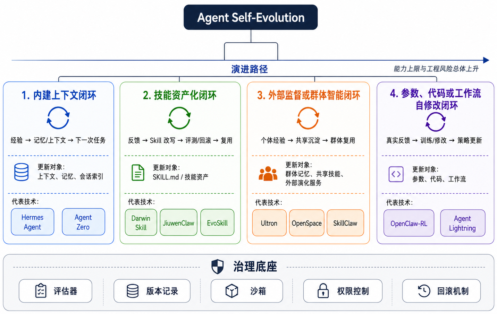

图1 原文总览图，展示四类闭环与十个代表项目。图片来自 [Datawhale hello-agents 原文](https://github.com/datawhalechina/hello-agents/blob/main/Extra-Chapter/Extra10-Agent%E8%87%AA%E8%BF%9B%E5%8C%96.md)，保留原图内容；本文重点展开前两条路线。[1]

| 路线 | 更新对象 | 反馈怎样生效 | 原文代表项目 | 本文安排 |
| --- | --- | --- | --- | --- |
| 内建上下文闭环 | 记忆、历史索引、项目上下文 | 下次任务读取与检索，改变决策依据 | Hermes、Agent Zero | 重点展开，见第3至5节 |
| 技能资产化闭环 | 技能说明、脚本、可复用流程 | 加载经过验证的操作方法，并持续修正 | Darwin Skill、JiuwenClaw、EvoSkill | 重点展开，见第6至8节 |
| 外部监督或群体智能闭环 | 共享记忆、共享技能、外部演化服务 | 汇聚多个实例的证据，验证后回流各宿主 | Ultron、OpenSpace、SkillClaw | 概览与衔接，见第9节 |
| 参数、代码或工作流自修改闭环 | 模型参数、Agent 代码、工作流结构 | 用训练或搜索产生策略候选，经评测后更新 | OpenClaw-RL、Agent Lightning | 概览与边界，见第10节 |

这不是必须逐级完成的升级阶梯。第三条主要扩大经验的复用范围；第四条包含不同的更新对象，其中参数更新涉及训练，代码和工作流更新则可以通过生成与搜索完成。后两条也能继续使用前两条的记忆与技能。

四条路线都需要回答三个问题：更新的依据能否追溯，更新后怎样被使用，以及如何证明它比旧版本更有用。自动修改本身不能作为效果证据。

快速阅读：先看本节总览与第2节两类重点路线的关系，再看第3至8节的流程和例子；第9至10节补全另外两条路线，第11至12节用于评估和实施。

## 2 两条重点路线的关系

上下文闭环通过保存、检索和更新经验，让 Agent 在后续任务中获得更合适的信息。技能资产化进一步把经验整理成带有适用条件、操作步骤和验证方法的可复用流程。两者都可以在模型权重保持不变的情况下改变行为。

本文以 Datawhale 的 Agent 自进化章节为起点，重点分析这两类闭环。[1] 项目机制采用官方说明；标为工程建议的架构、字段、判断规则和例子，是为理解与实现而整理的参考方案，不代表所有项目的统一规范。

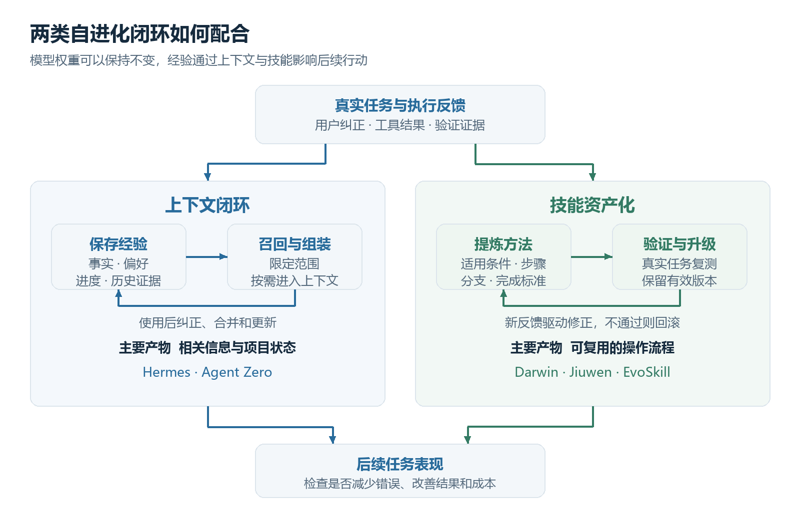

图2 两类闭环总览。记忆提供相关信息，技能提供可复用流程，二者均通过后续任务验证收益。根据原文分类及本文内容归纳。[1]

| 比较点 | 上下文闭环 | 技能资产化 |
| --- | --- | --- |
| 主要问题 | 以前发生了什么 当前有什么约束 | 这类任务应该怎样完成 |
| 持久对象 | 事实 偏好 项目状态 历史经验 | 技能说明 脚本 示例 验证规则 |
| 读取方式 | 重要信息直接加载 细节按需检索 | 先匹配适用场景 再加载操作流程 |
| 更新方式 | 添加 纠正 合并 清理过时信息 | 生成候选 测试 升级 或回滚 |
| 主要失效 | 召回无关或过时信息 错误归因 | 流程泛化过度 步骤失效 评测偏差 |
| 衡量收益 | 任务续接正确率 重复错误 检索质量 | 新任务成功率 回归表现 执行成本 |

### 用论文复现理解两者

假设一次复现任务因为预处理顺序错误而失败，修正后通过检查。记忆可以保存该项目的事实、失败原因和证据位置；技能则可以整理出指标异常时的排查顺序、每一步的判断条件及完成标准。这是贯穿全文的假设案例。

两类闭环不是互斥选项。记忆可以为技能提供证据；技能运行又会产生新轨迹和新经验。一次对话中的反思只能改善当前尝试，只有经验被持久保存并在未来正确使用，才形成跨任务闭环。

前两条路线通常可以在不训练模型的情况下落地，更新对象也便于检查与版本管理。因此本指南重点解释读写时机、记忆维护、技能验证，以及二者之间如何衔接。

## 3 路线一 上下文闭环的执行过程

工程建议：围绕 Agent 的主循环建立读取路径和写入路径。读取路径决定本次任务看到什么；写入路径决定哪些经验能进入下一次任务。先确保信息能够正确保存、找回和纠正，再扩大自动化范围。

```text
任务输入 → 读取项目状态 → 检索相关经验 → 组装上下文 → 执行与验证 → 更新记忆和状态 → 后续任务
```

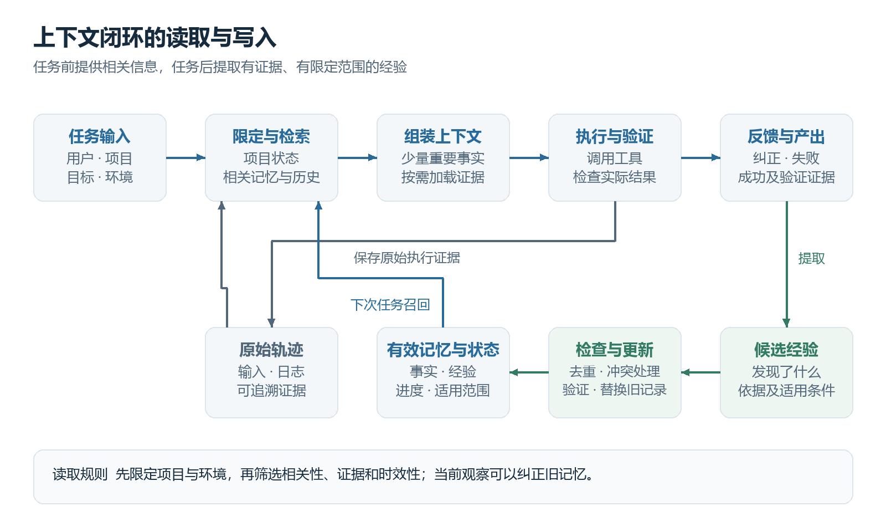

图3 上下文读写流程。上方为本次任务，下面为证据保存、候选提取和更新路径；更新后的信息回到检索环节。工程参考示意。

### 任务前读取

先识别用户、项目、当前目标与环境，再读取该范围内的项目状态和关键约束。只有在需要历史细节时才检索轨迹，例如相似报错、上次修复方式或用户曾经作出的决定。检索结果应保留来源，让 Agent 能继续查证。

为上下文设置独立预算。稳定且重要的事实可以常驻；长日志和历史原文按需加载。实际预算取决于模型窗口和任务复杂度，还要为当前任务、工具结果及后续推理留出空间。

### 任务中观察与校验

保存用户消息、工具输入输出、执行结果和验证证据。记忆提供诊断线索，当前工具观察负责确认现状。例如上次是依赖冲突，这次应先检查版本和报错，不能仅凭历史记录直接认定原因。

### 任务后提取候选记忆

在用户纠正、排错完成、阶段性验证通过或任务结束时触发整理。提取三个问题的答案：发现了什么，依据是什么，以后在什么情况下有用。一次临时失败或未经确认的模型猜测可以保留在轨迹里，不必立即升级为长期经验。

### 写入与维护

检查候选的范围、证据、重复与冲突。相同结论合并证据；新观察推翻旧结论时更新当前记录，并保留变更来源；已经失效的内容归档或删除。项目状态独立更新，记录实际完成的工作和下一步，而不是泛泛的会话摘要。

Reflexion 展示了通过反馈生成反思文本、再用于后续尝试的思路。[9] MemGPT 展示了有限上下文与外部记忆之间的信息调度思路。[10] 这些提供设计依据，但不意味着任意反思或检索组合都能自动提升表现。

### 最小上下文闭环的参考伪代码

```python
# 示意流程，函数名不对应某个项目的真实接口。
scope = identify_scope(task, user, project, environment)
state = load_project_state(scope)
memories = retrieve_memories(task, scope)
context = assemble_with_budget(task, state, memories)
result, trajectory = run_agent(context)
evidence = verify_result(result)
save_trajectory(trajectory, evidence)
candidates = extract_reusable_experience(trajectory, evidence)
accepted = check_scope_evidence_conflicts(candidates)
update_memories(accepted)
update_project_state(result, evidence)
```

读写接口应保留来源和版本。抽取失败不应破坏任务产出；未验证候选与当前有效记忆分开保存；重新进入任务时读取最新状态，并用当前工具观察检查环境。

## 4 路线一 记忆结构与检索策略

工程建议：区分当前工作上下文、项目状态、事实记忆、经验记忆与原始轨迹。它们可以用文件或数据库实现，重点是语义边界与生命周期清楚，不必一开始就引入复杂的记忆平台。

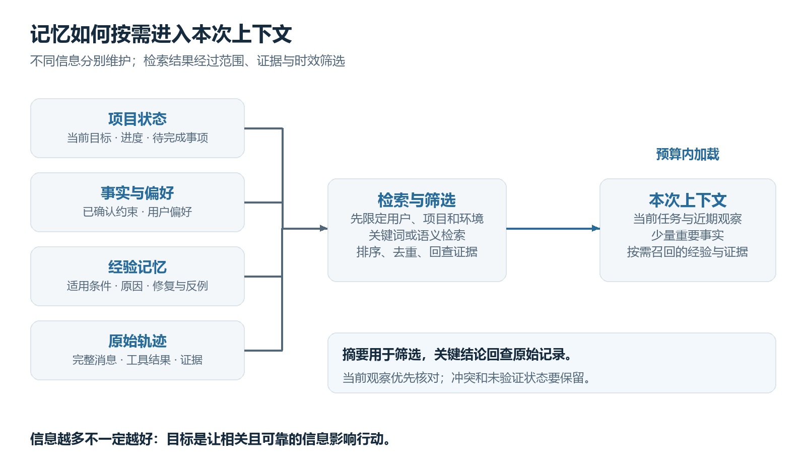

图4 不同存储经过统一检索与筛选进入本次上下文。不是把所有历史一次性加入提示词。工程参考示意。

| 信息类型 | 例子 | 维护方法 |
| --- | --- | --- |
| 当前上下文 | 本轮任务 工具结果 临时判断 | 任务推进时更新 超预算时压缩 |
| 项目状态 | 环境已安装 实验尚未运行 | 依据实际产出更新 支持任务续接 |
| 事实记忆 | 数据目录 已确认的环境约束 | 修改或重新验证过时事实 |
| 经验记忆 | 某种症状的已验证原因与修复 | 保留适用条件 反例和来源 |
| 原始轨迹 | 完整命令 日志 用户纠正 | 保留可追溯证据 按需读取 |

### 一条经验记录的参考字段

```yaml
id: exp-017
type: troubleshooting
scope: project-A / environment-v1
claim: 指标异常曾由归一化顺序错误引起
condition: 该数据集及当前预处理链
evidence: trajectory-041 / steps-18-23
status: verified
last_verified: 2026-10-07
supersedes: null
```

这些字段是示例，不属于某个项目的固定接口。verified 表示有验证证据，不表示对所有未来环境都成立。证据不足时标记为 candidate；被新证据替代时标记为 superseded，避免继续作为当前事实召回。

### 从简单检索逐步扩展

先按用户、项目和环境过滤，再做关键词检索。积累足够数据后，可以把关键词与语义检索结合，补充重排序和重复折叠。报错码、路径和版本号通常需要精确匹配；相似问题的不同表述可以使用语义匹配。

排序同时考虑相关性、证据质量和时效性。摘要用于筛选，关键结论回查原始证据。对于冲突记录，优先核对当前观察；无法解决的冲突应明确呈现，不要静默选择一个结论。

写入可由主 Agent 调用记忆工具，也可由任务后的整理流程处理。后台整理需要控制读写范围，并发更新时使用事务或版本校验，防止两个任务互相覆盖状态。

## 5 路线一 Hermes 与 Agent Zero

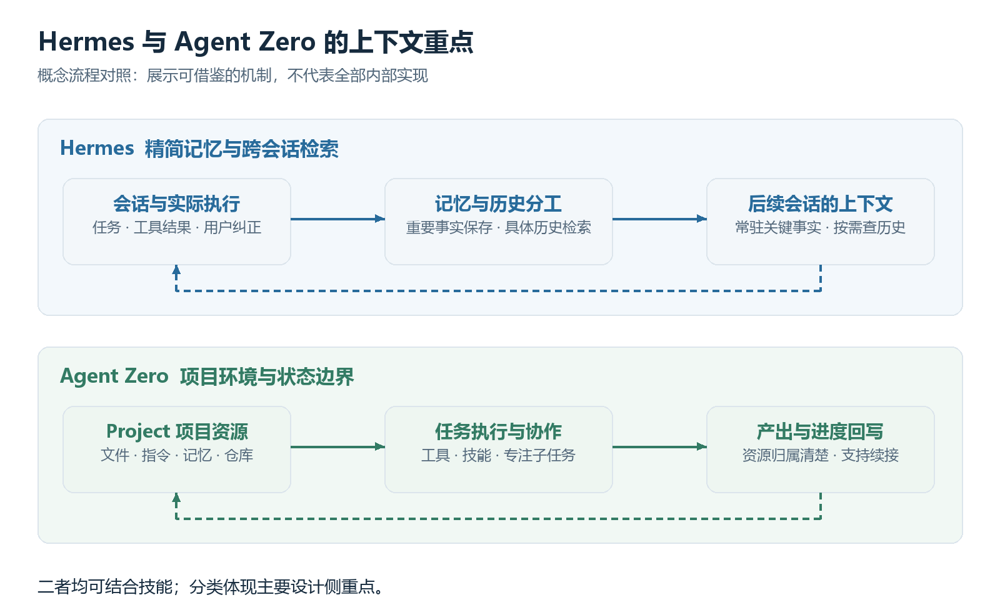

图5 Hermes 强调精简记忆与具体历史的分工，Agent Zero 强调项目资源与状态边界。依据官方说明绘制概念流程，不表示全部内部实现。[2][3][4]

### Hermes 的记忆与历史分工

Hermes 的官方文档区分 MEMORY.md 与 USER.md：前者保存环境事实和经验，后者保存用户偏好。记忆在会话开始时以快照形式提供，具体历史通过 session_search 检索；当前文档描述其会话存储使用 SQLite 与 FTS5。[2]

Hermes 同时支持从经验创建和改进技能，因此它跨越本文的两类路线。[3] 工程启示是把关键事实与历史细节分开，让常驻上下文保持精简，并检查记忆是否真的写入、是否被后续会话读取。

### Agent Zero 的项目边界

Agent Zero 提供包含文件、指令、记忆和仓库等资源的项目环境，并强调按项目隔离；工具、技能及内部提示可检查和编辑，也支持多 Agent 协作。[4] 它体现了上下文随工作环境持续积累的路径。

工程启示是让项目进度与环境状态有明确归属。用户偏好可跨项目使用，项目特有的依赖、数据位置和排错经验则应保留作用范围。长任务交接时，要带上可验证的产出位置和未完成事项。

| 设计视角 | Hermes | Agent Zero |
| --- | --- | --- |
| 本文关注点 | 精简记忆与跨会话检索 | 项目环境与持续状态 |
| 可借鉴机制 | 事实笔记 历史查询 技能积累 | 项目隔离 资源组织 工作交接 |
| 需要自行验证 | 记忆写入 召回与实际使用 | 隔离范围 状态一致性与续接 |

### 常见失效及对应措施

记忆写入了却没有被召回：检查过滤条件、检索词和读取时机。召回了却没有被使用：检查内容是否具体、位置是否合适，以及 Agent 是否理解其适用条件。

经验越来越多但效果下降：清理重复项，缩小适用范围，纠正错误归因，并保留未验证状态。长对话压缩后无法续接：独立保存项目状态及证据链接，而不是只依赖对话摘要。

这些项目说明提供机制参考，不是性能排名。选择时应围绕自己的任务验证，而不能仅依据功能清单判断哪个系统更会学习。

## 6 路线二 技能资产化的结构与生命周期

技能资产化把可复用的方法表达为 Agent 能发现、加载和执行的资产。安装一个静态技能完成了复用入口；基于执行反馈提出修改，并通过验证升级技能，才形成演化闭环。

Agent Skills 规范要求技能目录至少包含 SKILL.md，并使用 YAML 元数据与 Markdown 正文；scripts、references 和 assets 可按需提供。技能通常先暴露名称和描述，匹配后加载正文，详细资源按需读取。[8]

```text
metric-debug/
  SKILL.md
  scripts/check_preprocessing.py
  references/dataset-notes.md
  assets/checklist.md
```

### 一个技能应该说清楚什么

工程建议：名称与描述用于发现；正文明确适用条件、输入与前置检查、操作顺序、条件分支、工具或脚本、失败处理、输出及验证标准。写清不适用条件，可以减少把局部经验泛化为通用指令的问题。

```markdown
---
name: metric-debug
description: 排查复现实验的指标异常，核对数据与评测过程。
---
适用条件：存在论文配置及可比较的运行结果。
步骤：先核对划分，再检查预处理和评测口径。
异常处理：若关键配置缺失，先补齐证据再下结论。
完成标准：检查过程、配置及结果均可追溯。
```

上面的目录和内容是教学示例。实际技能需要补充具体命令、分支条件与测试；仅写几句原则，仍不足以构成可靠的操作流程。

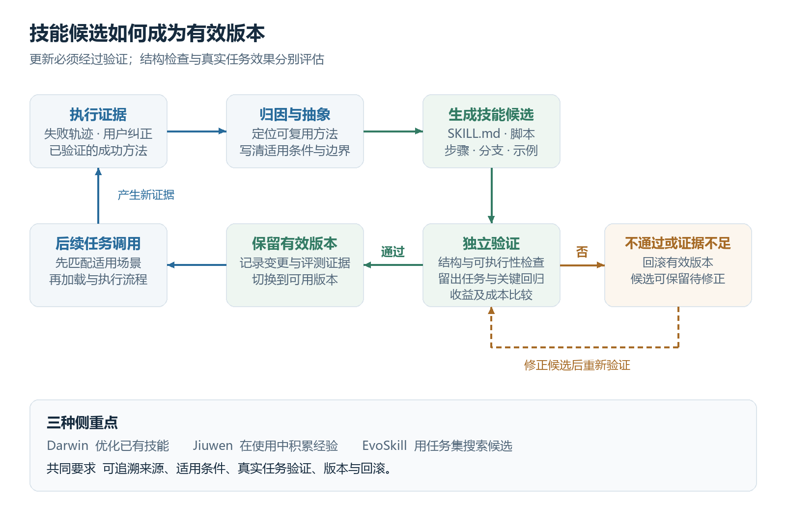

图6 技能演化流程。真实任务验证通过后才切换有效版本；证据不足或出现退化时保留候选并修正或回滚。结合原文闭环及三个项目的不同侧重点归纳，非某个项目的原始架构图。[1][5][6][7]

### 从轨迹到有效版本

```text
执行证据 → 归因与抽象 → 技能候选 → 结构检查 → 真实任务验证 → 发布有效版本或回滚
```

候选应记录来源与变更原因。验证同时检查能否加载、能否执行，以及是否改善任务结果。结构检查通过不等于效果提升；一次成功不等于泛化成立。

更新时尽量一次改变一个可归因因素。保存旧版本、测试结果与变更差异，验证通过后再切换有效版本。多技能存在冲突时明确优先级与选择规则，避免把全部技能同时加入上下文。

### 如何发现与选择技能

先用技能名称和描述匹配任务，再检查输入、环境、作用范围与前置条件。匹配后加载正文，需要时调用脚本或读取参考资料。多个技能都相关时，选择覆盖当前目标的一组最小流程，并明确先后顺序；不要因为技能存在就强制调用。

技能更新应区分补充局部排错经验与改变主流程。局部经验可以先作为附属记录；改变通用步骤或前置条件时，重新运行关键回归，并记录新旧版本的行为差异。

## 7 路线二 三种技能演化方式

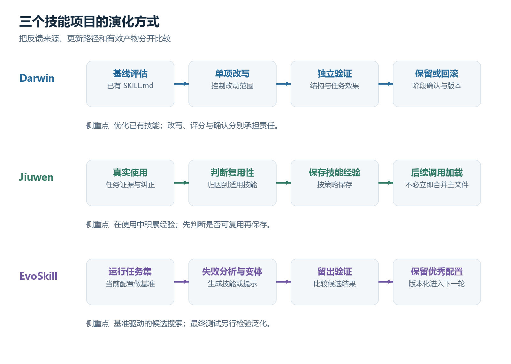

图7 用统一粒度比较三个项目的演化路径。Darwin 保留阶段确认，Jiuwen 按策略保存可复用经验，EvoSkill 主要依赖任务集与留出验证。概念归纳示意。[5][6][7]

### Darwin Skill 优化已有技能

Darwin Skill 将单个 SKILL.md 作为可编辑资产，结合结构检查与效果验证，使用独立评审、保留或回滚及人工确认。当前官方 README 描述九维评分体系，原文章中的八维描述对应较早版本。[5]

可借鉴的是控制改动范围、独立验证和保留有效基线。评分主要反映该评估流程中的质量；分数提高仍需要用真实任务及独立测试检查，不能推断所有场景都变好。

### Jiuwen 在使用中积累经验

原文章称为 JiuwenClaw 的项目链接，当前跳转至 JiuwenSwarm。其技能演化文档描述：主 Agent 根据当前任务证据判断经验是否可复用，再按保存策略保留；保存的经验可以在下次技能调用时加载，不必立即合并到 SKILL.md。[6]

可借鉴的是先保存具体经验，再决定何时整理进正式流程。用户纠正或错误关键词只能作为线索；应判断原因能否归属到该技能、经验是否可复用，避免每次失败都立即改写主文件。

### EvoSkill 使用任务集搜索候选

EvoSkill 用当前配置运行基准，分析失败后生成技能或提示变体，在留出验证集上评分，以 Git 分支保留表现较好的程序配置。其官方 README 将不依赖基准的演化和日常持续演化列为开发方向。[7]

可借鉴的是可重复的任务评测与候选比较。适合拥有一批任务和可判断结果的场景；如果只反复优化同一小组题目，很容易学会迎合评测。最终还需要未参与迭代的测试集。

| 项目 | 主要反馈 | 有效产物 | 实施前提 |
| --- | --- | --- | --- |
| Darwin | 技能检查与任务验证 | 优化后的技能版本 | 已有技能及可检查的质量标准 |
| Jiuwen | 实际使用中的任务证据 | 可加载的技能经验与更新 | 可靠归因与经验保存策略 |
| EvoSkill | 基准失败及验证集得分 | 技能或提示的候选配置 | 任务集 评分器与执行环境 |

这三者不是互相替代的固定阶梯。在线经验采集可以提供优化候选，离线评测负责筛选，版本机制负责管理有效资产。组合时仍需明确每个阶段的责任。

## 8 记忆到技能的完整例子

以下是工程示例。假设 Agent 负责复现实验，发现最终指标偏低；检查后确认某个数据集的归一化顺序与论文不同，修正并重新运行小规模验证后，结果符合预期。

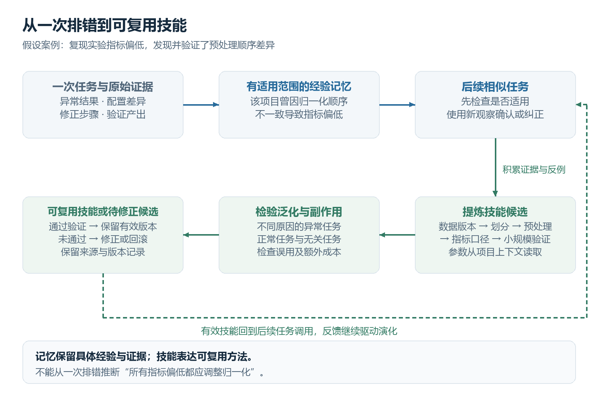

图8 记忆到技能的完整例子。先保存有范围的经验，再检验方法能否泛化，最终形成可复用技能；箭头表示后续反馈继续回流。假设案例示意。

### 第一步 保存本次证据与状态

轨迹保存原配置、异常结果、诊断过程和修正后的验证产出。项目状态写成“预处理已修正，小规模验证已完成，全量实验待运行”。这些信息用于续接具体任务，不需要先抽象成通用流程。

### 第二步 提炼有范围的经验

候选经验写成“项目 A 在该数据集上曾因归一化顺序不一致导致指标偏低，检查方法为对照预处理配置与样本输出”，并绑定证据。不能写成“指标偏低都应该调整归一化”。

### 第三步 在新任务中验证用途

后续出现类似症状时，召回经验并先检查适用条件。如果新的异常来自数据划分，保留这个反例。重复出现的有效检查方法，加上反例与边界，可以形成更可靠的技能候选。

### 第四步 抽象操作流程

技能按数据版本、划分、预处理、指标口径和随机性依次检查。每一步写明输入、判断依据和下一步；发现差异后先做小规模验证。项目路径、数据位置等具体参数从项目上下文读取，避免写死到通用技能中。

### 第五步 验证与发布

用多种不同原因的指标异常任务，以及正常任务、无关任务进行验证。观察它能否找到原因、是否误用、是否增加不必要操作。验证通过后保留新版本；失败则保留轨迹和候选，继续修正或回滚。

| 应保留在哪里 | 内容 |
| --- | --- |
| 项目状态 | 本次实验进度 产出位置 下一步 |
| 经验记忆 | 症状 条件 已验证原因 证据及反例 |
| 技能资产 | 可复用检查顺序 分支 脚本与完成标准 |
| 原始轨迹 | 每次具体执行的输入 日志与验证结果 |

是否提炼成技能，取决于方法能否明确表达和验证，不必机械要求出现固定次数。频繁复用是有用信号，但高频错误经验仍不值得固化。

## 9 路线三 外部监督与群体智能

这条路线把闭环放到 Agent 宿主之外，或让多个用户、设备、会话和 Agent 实例共享经验。它可以继续演化记忆或技能，区别在于证据的汇聚、更新和分发不再只局限于一个工作区。

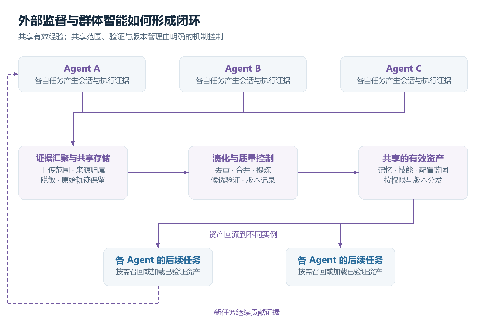

图9 不同实例汇聚证据，经质量控制形成共享资产，再按范围回流。图示为通用组合方案，不表示所有项目默认开启全部验证步骤。

### 三个代表项目

Ultron 围绕 Memory Hub、Skill Hub 与 Harness Hub 组织共享知识：记忆供检索，技能表达流程，配置蓝图用于复用完整 Agent 设置。其官方说明同时包含轨迹采集、记忆提炼及技能演化能力。[11]

OpenSpace 以技能管理和演化为主线，保留 FIX、DERIVED 与 CAPTURED 三类更新。当前 v2 文档强调依据具体执行证据判断技能质量，保留验证和版本历史，并通过技能包共享；这比单纯自动改写说明更接近一个外部质量控制层。[12]

SkillClaw 使用本地 Client Proxy 记录会话和管理技能库，可选 Evolve Server 从共享存储读取证据、演化技能并写回。多个客户端可以连接同一存储，让团队共享同一条回路。额外验证 worker 在官方说明中属于可选配置，不应误认为所有部署都默认具备独立验证。[13]

### 与前两条路线怎样衔接

记忆和技能先在本地形成候选，确定哪些证据允许共享，再上传到共享层。共享层执行去重、范围检查与候选验证，给有效版本保留来源；其他 Agent 按任务需要召回记忆或加载技能，并继续回传新的成功、失败和反例。

工程建议：个人偏好保留用户范围，项目路径保留项目范围，通用操作方法才逐步扩大共享范围。跨环境复用前核对依赖和参数，不把本地成功直接等同于团队通用。

### 什么时候需要它

当多个实例反复解决同类问题，或者同一套有效技能需要跨设备维护时，共享层能扩大经验复用。需要重点处理来源归属、权限、敏感内容、版本冲突和传播范围。多 Agent 分工本身只说明任务协作；如果经验没有被保存、验证并回流，还不能据此称为群体自进化。

## 10 路线四 参数代码与工作流自修改

这条路线把反馈用于改变模型参数、Agent 代码或工作流结构。上下文与技能主要改变模型收到的信息或操作指引；参数训练改变模型内部的行为倾向，代码与工作流更新则改变系统如何组织执行。

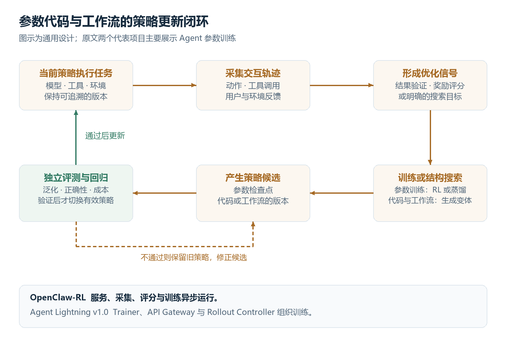

图10 上方形成优化信号，下方生成与评测策略候选。图示为通用框架；原文两个代表项目主要展示参数训练，不表示二者都自动改写 Agent 代码和工作流。[14][15]

### 需要区分的更新对象

| 更新对象 | 常见做法 | 可检查的产物 |
| --- | --- | --- |
| 模型参数 | 强化学习、监督训练或蒸馏 | 参数检查点、训练配置、独立评测结果 |
| Agent 代码 | 生成代码变体，在隔离环境中测试 | 代码差异、测试结果、版本与回滚记录 |
| 工作流结构 | 搜索步骤顺序、角色分工或工具选择策略 | 工作流配置、候选比较、任务回归结果 |

### 原文中的两个代表项目

OpenClaw-RL 把真实交互整理成训练轨迹，异步运行服务、轨迹采集、PRM 或 Judge 评分及策略训练。它支持强化学习及基于后续反馈的蒸馏方法；主线是把交互反馈转为参数优化信号。[14]

Agent Lightning 将实际 Agent 执行与训练链路连接起来。当前官方 v1.0 已重构为 Trainer、API Gateway 与 Rollout Controller 三个主要组件：网关采集模型交互，控制器组织 Agent 运行，训练器形成样本并更新策略。[15][16]

版本说明：原文章描述的 LightningStore、Tracer 与可插拔算法结构，对应较早的 Agent Lightning 形态。阅读或实现时应区分旧版与 v1.0，避免混用接口和架构名词。

### 什么时候考虑它

当有大量可重复任务、明确结果标准、可训练模型或可搜索的执行结构，并且前两条路线仍无法解决稳定的行为问题时，可以评估这条路线。它需要更可靠的反馈归因、隔离执行、独立测试和有效版本管理。

工程建议：参数训练关注奖励偏差与泛化；代码和工作流搜索关注候选的可执行性与副作用。评测提高只说明在相应任务和条件下的收益，不能直接推断总体能力持续上升。

## 11 如何证明闭环产生收益

工程建议：把经验采集、候选生成、验证和发布分开。评估要分别观察任务结果、经验使用过程和运行成本，避免用记忆条数、技能数量或文档评分替代实际收益。

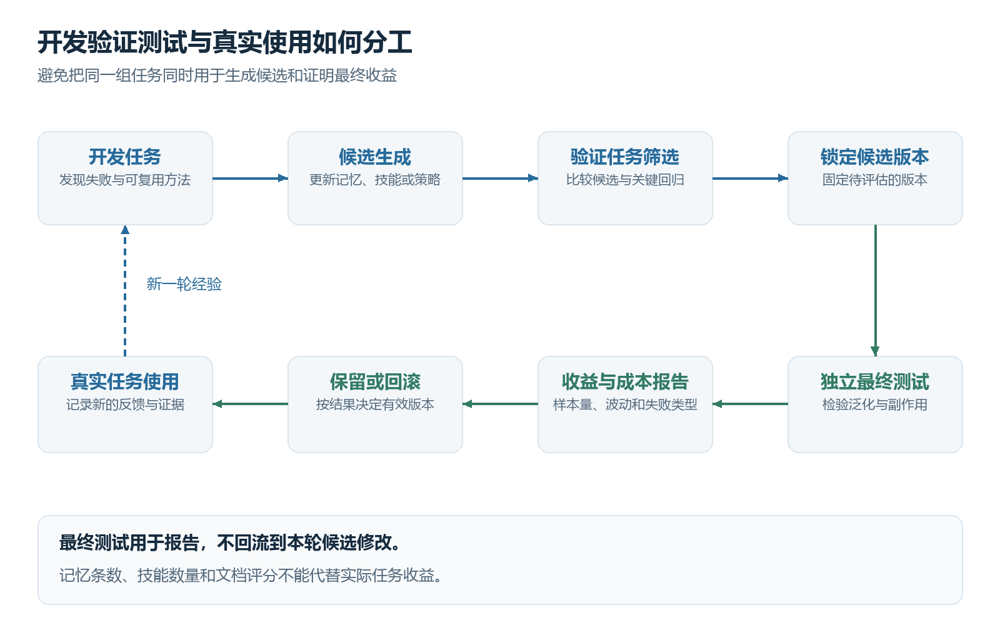

图11 开发用于生成候选，验证用于选择候选，独立最终测试用于报告泛化。后续真实任务产生新证据，但最终测试结果不回流到本轮调参。工程参考示意。

| 评估对象 | 建议观察指标 | 需要留意的问题 |
| --- | --- | --- |
| 任务结果 | 完成率 验证通过率 结果正确性 | 任务难度变化 是否只提高熟悉题 |
| 任务续接 | 状态恢复正确率 重复工作量 | 摘要遗漏 已完成与待完成混淆 |
| 记忆使用 | 相关召回 错误记忆使用 重复犯错 | 有召回却未使用 过时事实误用 |
| 技能使用 | 适用场景命中 新任务表现 回归失败 | 正常任务被误触发 技能互相冲突 |
| 运行成本 | 耗时 模型调用量 工具调用量 | 收益是否抵消整理 检索和评测成本 |

### 保持比较条件一致

固定模型、工具权限、任务输入与执行环境，比较无经验、有相关记忆、有技能，以及记忆和技能同时使用的配置。尽量复用同一任务集；对随机性明显的任务重复运行，并报告样本量、波动与失败类型。

### 区分三类数据

开发任务用于发现问题和生成候选；验证任务用于选择候选；最终测试任务用于检查泛化。反复使用验证集也可能过拟合，因此最终测试集应独立，不能用于继续修补被评估的版本。

### 覆盖正常与异常场景

测试集应包含相似失败、不同原因但症状相近的失败、正常任务、过时记忆和无关任务。只测试技能最擅长的失败类型，会遗漏误触发和副作用。

### 保留证据而非只看自评

优先使用可执行测试、可检查产出和明确结果标准。需要模型评审时，将修改与评审分开，使用明确规则，并保留原始结果供复查。不同评委仍可能有共同偏差，不能把独立评审当作绝对可靠。

发布规则可以要求目标任务有可重复收益，关键回归无退化，且额外成本可接受。具体阈值由任务决定，本文不提供脱离场景的通用分数线。

## 12 从最小实现逐步扩展

工程建议：先实现一种任务的完整闭环。读写接口和版本机制保持简单，确认每个环节有用后再加入语义检索、后台整理和自动候选搜索。

### 阶段一 让任务能够继续

保存轨迹和项目状态，在新任务开始时读取进度。完成标准是能从真实产出恢复已完成事项和下一步，并避免重复执行已完成的工作。

### 阶段二 让已验证经验可复用

增加结构化经验表，支持作用范围、来源、验证状态和修改记录；先用关键词检索。完成标准是相似问题能够召回相关证据，同时能纠正旧结论并拒绝无关经验。

### 阶段三 让方法成为技能

从可验证的经验中提炼技能候选，补齐适用条件和验证标准。建立技能版本与小型任务集。完成标准是候选能被加载、执行，并在未参与提炼的任务上体现收益。

### 阶段四 让更新可持续

增加任务后整理、候选生成、独立验证和有效版本切换。遇到归因不清或测试结果不稳定时保留候选；失败时回滚有效版本。根据任务量再决定是否需要多用户共享和更多基础设施。

| 常见问题 | 对应设计 |
| --- | --- |
| 全量历史挤占上下文 | 精简常驻事实 按需检索 为当前任务留预算 |
| 把猜测写成长期事实 | 记录证据和验证状态 未确认内容保持候选 |
| 局部经验被通用化 | 显式保存项目 环境 适用条件与反例 |
| 外部文本污染后续指令 | 来源内容作为证据加载 遵守宿主权限与指令边界 |
| 多任务写入互相覆盖 | 事务 版本校验或单写入者策略 |
| 技能越改越长 | 删除重复步骤 把细节放入按需资源 验证真实收益 |

关键实现边界：记忆保存事实与证据，项目状态保存进度，技能保存可复用方法，轨迹保存具体执行。保持这些边界，便于定位错误究竟来自召回、归因、流程还是执行。

自动化程度可以逐步增加，但每次更新都应留下可审查差异和验证结果。没有足够证据时，保存候选往往比立刻改写有效资产更有价值。

### 从本地闭环扩展到其他路线

完成上下文与技能闭环后，先检查是否真的需要跨设备或团队复用。存在重复试错和技能分发需求时增加共享层，并复用已有的来源、验证和版本机制。共享层的引入不要求同时训练模型。

只有当任务规模、结果反馈和资源条件支持时，再评估参数训练或代码、工作流搜索。先做小范围对照实验，记录额外成本与泛化结果，确认收益后扩大范围。四条路线按实际问题组合，而不按名称机械升级。

| 观察到的问题 | 优先检查的路线 | 先做的事 |
| --- | --- | --- |
| 经常忘记进度、约束或已排除的原因 | 上下文闭环 | 分开保存状态和经验，验证检索与续接 |
| 同类任务反复重新设计操作步骤 | 技能资产化 | 提炼有边界的流程，建立真实任务回归 |
| 多实例重复踩坑、技能版本各自维护 | 外部监督或群体智能 | 建立可追溯的共享、验证与分发机制 |
| 有大量反馈但行为问题长期稳定存在 | 参数、代码或工作流更新 | 明确更新对象，先做独立评测与成本对照 |

## 13 来源与延伸阅读

来源查阅日期为2026年10月7日。项目说明可能继续更新；本文描述机制，不据此给项目作性能排名。正文中的工程建议和假设案例用于设计参考，效果需在实际任务中验证。

1. [Datawhale Agent 自进化的四类闭环](https://github.com/datawhalechina/hello-agents/blob/main/Extra-Chapter/Extra10-Agent%E8%87%AA%E8%BF%9B%E5%8C%96.md)：本文的分类起点及项目线索。

2. [Hermes Persistent Memory](https://hermes-agent.nousresearch.com/docs/user-guide/features/memory)：事实记忆 用户偏好 会话快照及历史检索机制。

3. [Hermes Agent 官方仓库](https://github.com/NousResearch/hermes-agent)：记忆 会话检索及技能学习的组合。

4. [Agent Zero 官方仓库](https://github.com/agent0ai/agent-zero)：项目隔离 持续工作环境及可检查资源。

5. [Darwin Skill 官方仓库](https://github.com/alchaincyf/darwin-skill)：技能评估 独立审查 保留或回滚及人工确认。

6. [JiuwenSwarm Skill Self Evolution](https://github.com/openJiuwen-ai/jiuwenswarm/blob/develop/docs/en/SkillSelfEvolution.md)：原 JiuwenClaw 链接的当前去向及经验保存加载流程。

7. [EvoSkill 官方仓库](https://github.com/sentient-agi/EvoSkill)：失败分析 候选生成 留出验证及版本管理。

8. [Agent Skills Specification](https://agentskills.io/specification)：技能目录 元数据及渐进加载规范。

9. [Reflexion 论文](https://arxiv.org/abs/2303.11366)：通过反馈生成反思文本并影响后续尝试。

10. [MemGPT 论文](https://arxiv.org/abs/2310.08560)：有限上下文与分层记忆的信息调度。

建议先阅读原章节建立全局视角，再阅读 Hermes 记忆文档与 Agent Skills 规范理解接口。需要技能优化时，按已有技能优化、在线经验积累或基准搜索的目标，分别阅读 Darwin、Jiuwen 与 EvoSkill。

11. [Ultron 官方仓库](https://github.com/modelscope/ultron)：共享记忆、技能和配置蓝图及其演化机制。

12. [OpenSpace 官方仓库](https://github.com/HKUDS/OpenSpace)：技能管理、证据驱动演化、共享与版本管理。

13. [SkillClaw 官方仓库](https://github.com/AMAP-ML/SkillClaw)：本地代理、可选演化服务、共享存储与可选验证。

14. [OpenClaw-RL 官方仓库](https://github.com/Gen-Verse/OpenClaw-RL)：交互反馈、异步采集评分及参数训练。

15. [Agent Lightning 官方仓库](https://github.com/microsoft/agent-lightning)：当前 v1.0 架构及旧版本说明。

16. [Agent Lightning v1.0 文档](https://microsoft.github.io/agent-lightning/stable/)：实际 Agent 执行与训练链路的组织方式。

图片说明：图1直接采用 Datawhale hello-agents 原文总览图，来源见图注；其余流程图依据原文章、官方项目说明及工程分析重新绘制。图注区分概念归纳与工程参考方案。图片采用相对路径，分享 Markdown 时需同时保留 assets/self-evolution 目录。

[1]: https://github.com/datawhalechina/hello-agents/blob/main/Extra-Chapter/Extra10-Agent%E8%87%AA%E8%BF%9B%E5%8C%96.md
[2]: https://hermes-agent.nousresearch.com/docs/user-guide/features/memory
[3]: https://github.com/NousResearch/hermes-agent
[4]: https://github.com/agent0ai/agent-zero
[5]: https://github.com/alchaincyf/darwin-skill
[6]: https://github.com/openJiuwen-ai/jiuwenswarm/blob/develop/docs/en/SkillSelfEvolution.md
[7]: https://github.com/sentient-agi/EvoSkill
[8]: https://agentskills.io/specification
[9]: https://arxiv.org/abs/2303.11366
[10]: https://arxiv.org/abs/2310.08560
[11]: https://github.com/modelscope/ultron
[12]: https://github.com/HKUDS/OpenSpace
[13]: https://github.com/AMAP-ML/SkillClaw
[14]: https://github.com/Gen-Verse/OpenClaw-RL
[15]: https://github.com/microsoft/agent-lightning
[16]: https://microsoft.github.io/agent-lightning/stable/
